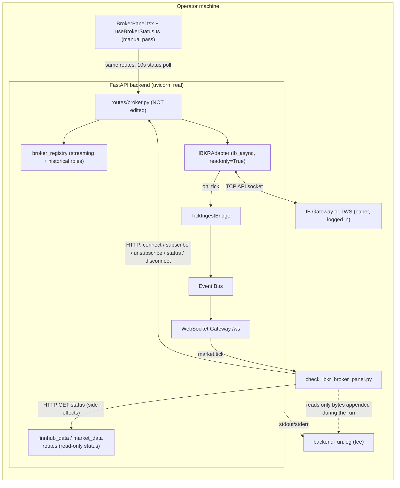
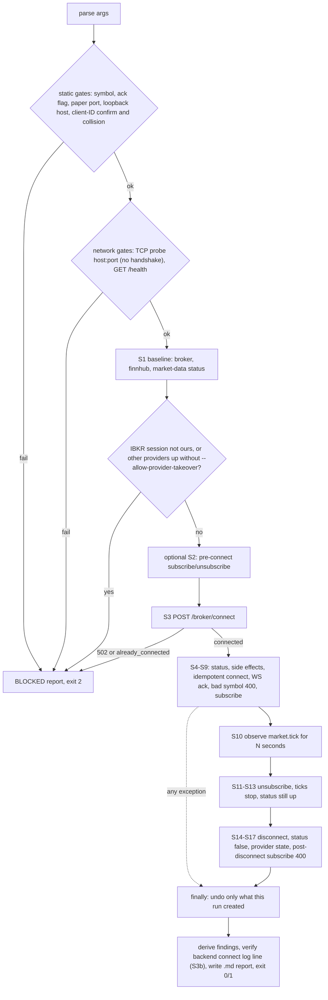
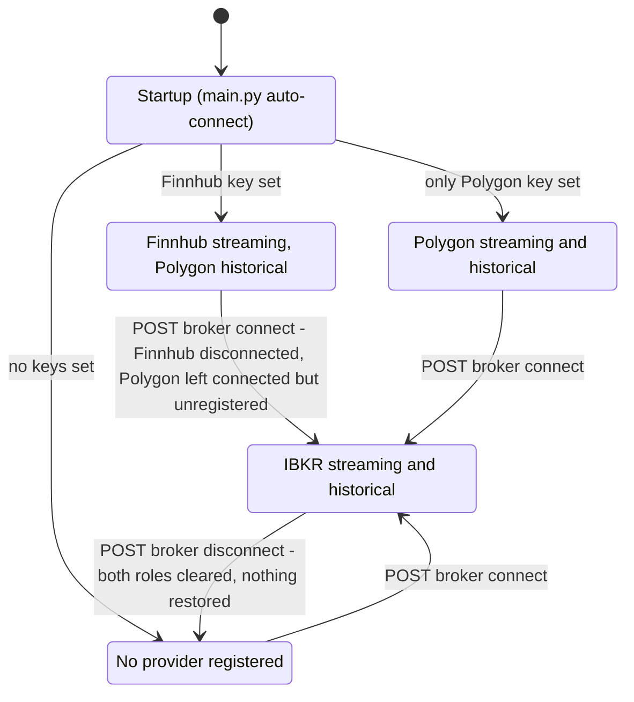

# IBKR broker panel — empirical validation harness

**Status: DEFERRED (2026-09-19).** Harness built and stub-tested; **never run against real IBKR**; blocked on no reachable paper session, then deliberately set aside by Saqib. Temp id `ibkr-broker-panel-validation-deferred` (no decision number assigned; see "Decision log" below). Parked in `../decisions/future-ideas.md` #27 with its trigger.

Nothing in this repo has ever exercised `backend/app/api/routes/broker.py` (`connect` / `subscribe` / `unsubscribe` / `status` / `disconnect`) or `BrokerPanel.tsx` / `useBrokerStatus.ts` against a real IBKR connection (`backend/README.md`: ❌ "An actual live connection to a running Gateway"). This doc defines the first real check, in the same spirit as `scripts/check_premarket_data_availability.py`: real account, real findings, honestly reported.

## Deferral record (2026-09-19)

**What was attempted:** Task 2 — first empirical validation of `broker.py`'s five routes and `BrokerPanel.tsx` / `useBrokerStatus.ts` against an already-authenticated IBKR Paper session.

**Why it did not run — two independent checks, same answer:**

| Where | Finding |
|---|---|
| Authoring sandbox | TCP probe of `127.0.0.1:4002` refused. That environment has no route to Saqib's machine (outbound limited to package/GitHub hosts). |
| Saqib's machine (local session, clean tree on `main` @ `3c80afd`) | Configured endpoint `127.0.0.1:4002`, client ID `1`. No listener on 4002 (or 4001/7496/7497), no TWS or IB Gateway process. Client-ID uniqueness therefore unverifiable. No route called, no config changed, `broker.py` untouched, worktree clean. |

**Decision:** avoid this process for now; keep it documented (Saqib, 2026-09-19). Deferred, not abandoned.

**What exists:** `backend/scripts/check_ibkr_broker_panel.py` (guards + report; exercised only against a stub with a fake `IB`, i.e. validates the script's own logic, **not** IBKR), this runbook, and the predictions table below.

**What is NOT known:** anything about real `IBKRAdapter` behaviour through the routes, real tick flow, the panel's real rendering, or whether P1–P7 hold. Do not cite this doc as evidence that the broker panel works or fails.

### Resume checklist

1. Paper IB Gateway (4002) or TWS (7497) running and logged in (IB Key approved), API socket enabled, `127.0.0.1` trusted. Verify: `ss -ltn | rg ':4002\b'` shows a listener.
2. Confirm host/port/client ID: `grep '^IBKR_' backend/.env`. Nothing else may use that client ID (other uvicorn instances, notebooks, backtest runs).
3. Confirm the harness is in the tree (`backend/scripts/check_ibkr_broker_panel.py`), then follow the Runbook below from step 2.
4. Send the generated report back; results ship as their own delivery (`ibkr-broker-panel-validation-results`), flipping `backend/README.md`'s ❌ line and adding the decision-log entry.
5. Still open regardless of the run, awaiting Saqib's call: P5 (explicit `fetchFields`), P1 (status semantics, owned by `broker.py`'s owner).

## Boundaries (enforced in `backend/scripts/check_ibkr_broker_panel.py`, not just stated)

| Boundary | Enforcement |
|---|---|
| Paper only | Configured port must be 4002 (Gateway paper) or 7497 (TWS paper). 4001/7496 and anything else abort before any request. |
| Loopback only | Configured host must be `127.0.0.1` / `localhost` / `::1`. |
| No config edits | The script only reads `IBKR_HOST/PORT/CLIENT_ID/BACKTEST_CLIENT_ID` from settings. A collision or wrong value aborts; it is never "fixed". |
| No credentials | Never read, printed or inspected. Account-like IDs (`DU1234567`…) are redacted from captured log lines. |
| No orders | `broker.py` has no order routes; none are called. The adapter connects `readonly=True`, and the script verifies that from the backend's own log line (`S3b`). |
| Client ID | `--confirm-client-id N` must equal the configured ID: the operator asserts no other active process uses it (the script cannot see that from outside). `IBKR_BACKTEST_CLIENT_ID == IBKR_CLIENT_ID` aborts. |
| Only what it created | Proceeds only if `POST /broker/connect` returns `connected`. `already_connected`, or a `connected=true` baseline that no Finnhub/Polygon provider explains, aborts without touching anything. Cleanup disconnects/unsubscribes only what this run created. |
| Harmless data | One liquid symbol (default `SPY`), unsubscribed afterwards; one deliberately unresolvable symbol to check the 400 path. |
| Unavoidable account sync | The adapter calls `connectAsync(..., readonly=True)` with no `fetchFields`, so ib_async's default (`StartupFetchALL`: positions, open + completed orders, account updates, executions) runs on every connect, verified in ib_async 2.1.0 source. The script never reads that data but cannot prevent it, so `--ack-startup-account-sync` is required. This is surfaced as a design fork (P5), not changed here. |
| Blockers stop the run | Gateway not listening, backend down, connect 502 (login / 2FA / timeout) → report `BLOCKED` with the backend's verbatim detail. |

## Data flow between components



## Internal flow of the script



## Provider registry as read from code (predicted transitions; observed only against stand-in providers so far)



In the `FH` state, `GET /broker/status` already returns `connected=true` (P1): the route asks whichever provider streams.

## Runbook

Prerequisites (from `backend/README.md` IBKR setup): paper IB Gateway (port 4002) or paper TWS (7497) **already logged in** (IB Key tap done by you), API socket enabled, `127.0.0.1` in Trusted IPs. If login or 2FA is needed the run is blocked; that is a valid result.

1. Confirm what will be used (values only, no secrets): `grep '^IBKR_' backend/.env` → host, port, client ID. Stop any other process using that client ID (other uvicorn instances, notebooks, a running backtest).
2. **Start the backend and the script from the same shell/venv/`backend/.env`.**
   ```bash
   cd backend
   uvicorn app.main:app 2>&1 | tee backend-run.log        # terminal 1
   ```
3. **UI-1 (before running the script, no clicks):** open the frontend, expand the Broker panel, screenshot exactly what it shows (status text, whether Connect is enabled). See the UI checklist below.
4. Run the script (terminal 2):
   ```bash
   cd backend
   python scripts/check_ibkr_broker_panel.py \
       --confirm-client-id <the client ID from step 1> \
       --ack-startup-account-sync \
       --backend-log backend-run.log \
       --probe-preconnect
   # add --allow-provider-takeover if the script says Finnhub/Polygon are connected and you accept that
   # they will be displaced (restart the backend afterwards to restore them)
   ```
5. Send back the generated `ibkr-broker-panel-validation-<UTC>.md` verbatim, plus the UI-1 observation. Do not commit the report or `backend-run.log`.

Residual risk stated plainly: the script reads settings from its own environment; the backend process could differ. `S3b` checks the backend's own connect log line against what you confirmed and FAILs loudly if they differ, but that is after the fact. Launching both from the same shell is what actually prevents it.

Run outside the regular US session and `S10` is `INCONCLUSIVE`, not PASS or FAIL. Re-run during the regular session for the tick-flow verdict.

## Check inventory

| ID | Route / observation | Claim being tested (source) |
|---|---|---|
| S1 | `GET /broker/status` baseline + finnhub + market-data | UI text: "Not connected — IBKR's normal resting state" (`BrokerPanel.tsx`) |
| S2a/b | pre-connect subscribe/unsubscribe (opt-in) | "400 Not connected" (`broker.py` docstring, `subscribe` route) |
| S3, S3b | `POST /broker/connect` | 200 `connected`; readonly, host/port/client ID as confirmed (`broker.py`, `ibkr_adapter.connect`) |
| S4 | status after connect | `connected: true` |
| S5, S15 | finnhub / market-data status after connect and after disconnect | `take_over_streaming` semantics (`broker_registry.py`) |
| S6 | connect twice | `already_connected` idempotency |
| S7 | `/ws` `market.tick` ack | `channels.py` protocol |
| S8 | subscribe `ZQXWVK` | 400 + `SymbolNotFoundError` text (README: mock-tested only) |
| S9, S9b | subscribe symbol, subscribe again | 200 `subscribed`; adapter skips duplicates |
| S10 | ticks reach `market.tick` | README: "real IBKR ticks now flow through the same pipeline" |
| S11a/b, S12 | unsubscribe, ticks stop, unsubscribe again | `cancelMktData` effect; adapter no-op path |
| S13 | status after unsubscribe | connection stays up |
| S14a/b | disconnect, status false | `disconnected`; `is_connected()` reflects reality |
| S16 | subscribe after disconnect | 400 "Not connected" |
| S17 | disconnect twice | route tolerates nothing connected |

## Predictions from reading the code (hypotheses until the real run says otherwise)

| # | Prediction | Basis | Settled by |
|---|---|---|---|
| P1 | `GET /broker/status` is provider-agnostic: it is `connected=true` whenever *any* streaming provider (Finnhub) is connected. `BrokerPanel` would then show "● Connected" before IBKR is ever connected, **and its Connect button is `disabled` when `connected === true`**, so IBKR could not be connected from the panel while Finnhub streams. `useBrokerStatus.ts`'s comment says the poll reads `IBKRAdapter.is_connected()`. | `broker.py` `status()`; `BrokerPanel.tsx` line with `disabled={connecting \|\| connected === true}` | S1, derived finding, UI-1. Route-level behaviour reproduced with a stand-in streaming provider (stub only, not real Finnhub/IBKR). |
| P2 | IBKR connect displaces Finnhub; `/broker/disconnect` clears both registry roles without restoring; a Polygon adapter that was only historical stays connected but unregistered, and `/market-data/status` may still say `connected`. | `broker_registry.take_over_streaming`, `broker.py` `disconnect()`, `market_data.py` `status()` | S5, S15, derived findings |
| P3 | `/unsubscribe` lacks `/subscribe`'s `is_connected()` guard, and `/subscribe`, `/unsubscribe`, `/disconnect` act on whatever the streaming provider is, with no IBKR check. | `broker.py` | S2a/b (`--probe-preconnect`) |
| P4 | An *intentional* `/broker/disconnect` logs the WARNING "IBKRAdapter lost its connection … Call POST /broker/connect again", because ib_async's `disconnect()` fires `disconnectedEvent` (verified in ib_async 2.1.0 source). Misleading log noise, not a functional bug. | `ibkr_adapter._on_disconnected`; ib_async source | Backend log excerpt |
| P5 | Every connect syncs paper account snapshot data into ib_async's memory (default `fetchFields`). Design fork for you: pass an explicit `fetchFields` in `IBKRAdapter.connect` for a data-only adapter. **Not changed here; awaiting your direction.** | ib_async source; `ibkr_adapter.py` `connect` | Source-verified; no run needed |
| P6 | `/broker/subscribe` returns "subscribed" without any evidence ticks flow, and the adapter forwards only `ticker.last` (no `reqMarketDataType` fallback). A paper account without market-data entitlements, or a closed market, gives "subscribed" plus zero ticks. | `ibkr_adapter.subscribe`, `_on_pending_tickers` | S10 + backend log (IB error 354 / 10089 / 10167) |
| P7 | A failed connect whose exception has empty text (e.g. `TimeoutError`, ib_async default `timeout=4`s) would render as "IBKR connect failed: . Is IB Gateway running…". | `broker.py` f-string; `connectAsync` | S3 verbatim detail (only if it occurs) |

## UI checklist (manual; the script cannot drive React)

**UI-1 — before the script, no clicks, backend started normally:** expand the panel («). Record: status text; whether Connect and Disconnect are enabled; the helper text shown. Tests P1.

**UI-2 — after the script, backend freshly restarted only if UI-1 showed Connect enabled** (otherwise P1 blocks it; report that and skip):

| Step | Expected per code | Record |
|---|---|---|
| Click Connect | button shows "Connecting…", then "● Connected"; `connectError` empty | time to connected; any error text verbatim |
| Type `spy` in the input | uppercased; Subscribe enabled | — |
| Subscribe | row `SPY` appears; "Connected. No symbols subscribed yet" text disappears | any `symbolActionError` |
| Type `zqxwvk`, Subscribe | red backend detail under the input; no row added | exact text |
| Click × on `SPY` | row disappears immediately (optimistic) | whether backend call succeeded |
| Click Disconnect | "○ Not connected"; rows cleared | status after next 10s poll |
| Reload page while connected | status re-reads `connected`; **`subscribedSymbols` resets to empty** although IBKR is still subscribed (documented limitation) | confirm |

## Hand-back protocol for `broker.py`

This delivery does not touch `backend/app/api/routes/broker.py` (a sibling task owns it this round; at `main` = `3c80afd` it already contains a module-level `is_connected()` — check for a collision before merging). Any finding that real behaviour differs from the UI/docs is documented precisely here and in the results delivery, and handed back, never patched from this track.

## Decision log

None assigned in this delivery: it records a deferral and settles no design fork (the deferral itself lives in `../decisions/future-ideas.md` #27, which carries a trigger rather than a number). The **results** delivery carries the decision-log entry (temp id `ibkr-broker-panel-validation-results`), assigned a number only at merge after re-checking `main` and both decision logs. P5 (explicit `fetchFields`) is an open fork awaiting your call, not yet a `future-ideas.md` entry.

## Results

_None. The run is deferred (see "Deferral record"); this section stays empty until a real run happens._
