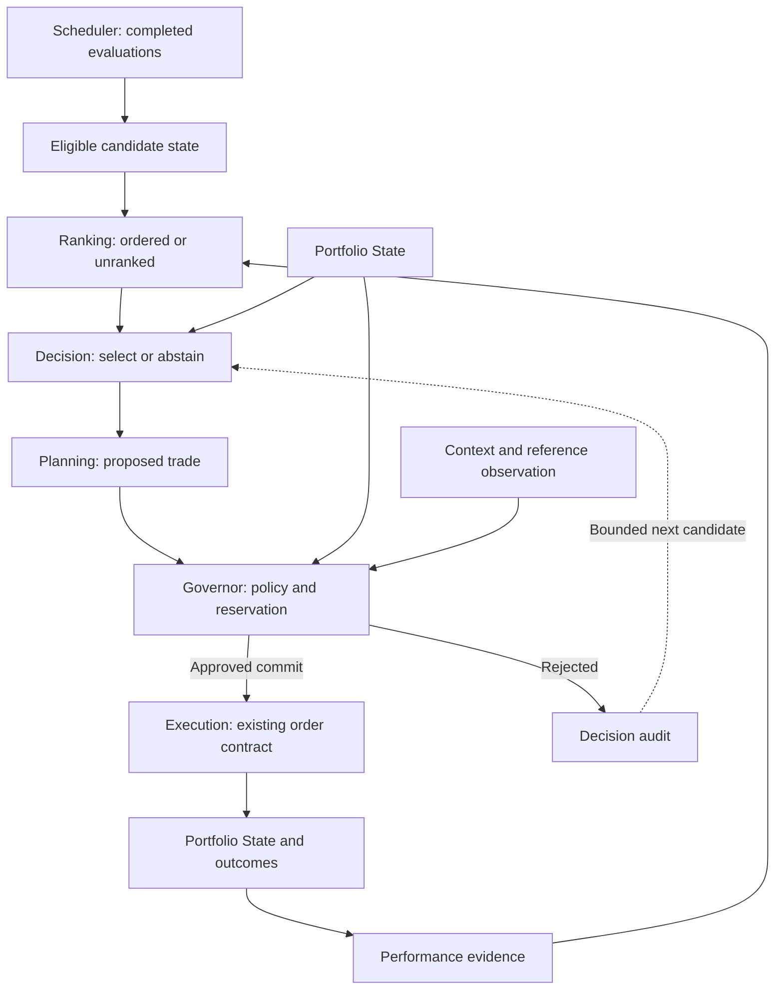
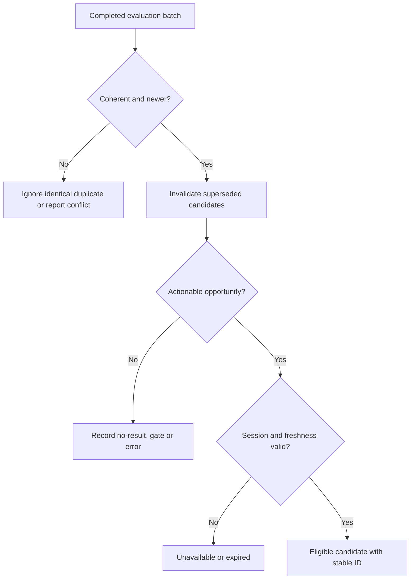
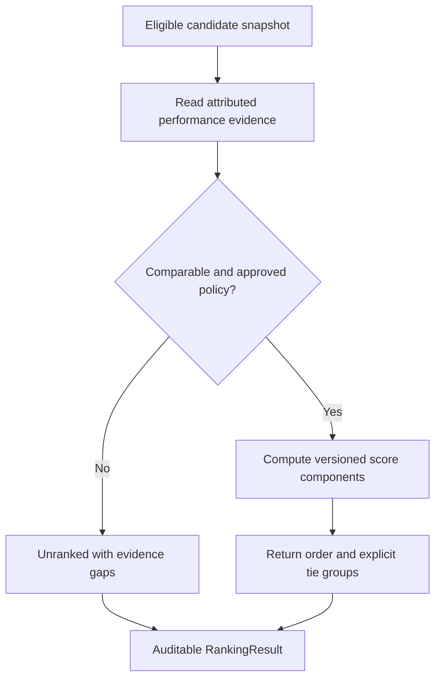
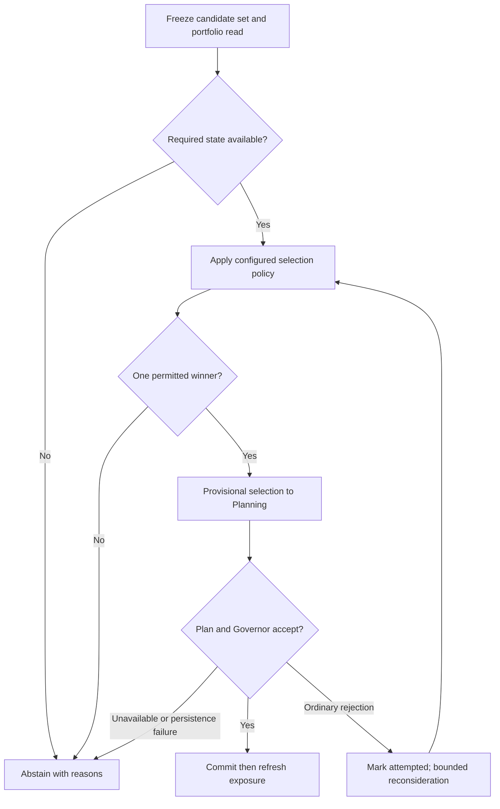
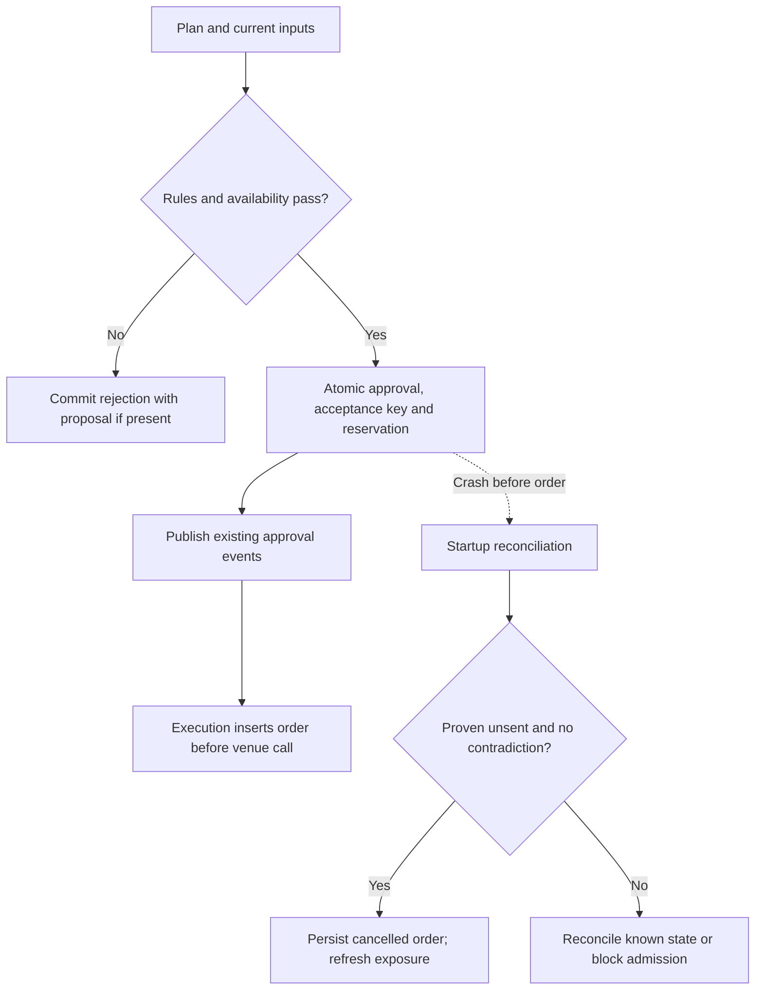

# Trading Intelligence Architecture
**Version:** 1.7 — generalized hotkey/action model (Action Categories, Safety Levels, Hotkey Context, action-to-multi-device bindings); `LONG`/`SHORT` intent actions replace `BUY`/`SELL`/`PROPOSE_LONG`/`PROPOSE_SHORT`; `FocusedTile` renamed `TradeTarget`
**Companion documents:** [`system-design.md`](./system-design.md) — that doc explains *how the system is built* (modules, interfaces, deployment, folder structure). This doc explains *how the system thinks* (market state, context, strategy, decision logic). [`strategy-engine-design.md`](./strategy-engine-design.md) — §0–§6, §8–§9, §11–§13: Strategy internals, versioned configs, entry-timing model, Performance Intelligence's outcome schema, and how Decision Engine/Governor consume it. Originally a direction lock only (decisions #87–88); all seven v1 strategies plus Scheduler/`gate_conditions` are now built (decisions #99–#117) — see `strategy-engine-design.md`'s own status header for the full citation. As of `split-strategy-engine-design-doc` (decision #142), that plan's former §7 (Backtest Runner), §10 (Open Decisions), and §14–§18 (per-strategy build history) live in their own sibling files: [`backtest-runner-design.md`](./backtest-runner-design.md), [`strategy-engine-open-decisions.md`](./strategy-engine-open-decisions.md), [`strategy-engine-build-history.md`](./strategy-engine-build-history.md). [`../decisions/future-ideas.md`](../decisions/future-ideas.md) holds concepts raised and deliberately deferred, with the reasoning intact, so they don't need to be re-argued from scratch later. [`../decisions/confirmed-decisions.md`](../decisions/confirmed-decisions.md) is the running settled-decisions log. Keep these separate; a change to trading logic shouldn't require touching WebSocket plumbing, and an idea that isn't ready yet shouldn't clutter a document meant to describe what's actually built. See [`../README.md`](../README.md) for how the whole `docs/` tree is organized.

---

## 1. Central Idea

Every component in this system, whatever else it does, is ultimately answering one question: **"What is the current market state?"** — not "what's the latest tick." The chart, the AI, execution, and eventually replay are all *consumers* of state, not owners of their own private view of it. This is what makes the platform a **Trading Intelligence Operating System** rather than a chart with some scripts attached.

The pipeline below mirrors how a discretionary trader actually reasons:

```
What market am I in?          →  Market State
What is today's situation?    →  Context
What opportunities exist?     →  Strategy Engine → Opportunity Engine
Which one is best?            →  Decision Engine
How should I trade it?        →  Trade Planning Engine
Can I afford it?              →  Governor
Execute.                      →  Execution Engine
Manage.                       →  Position Monitor
Learn.                        →  Performance Intelligence
```

---

## 2. Two Kinds of Intelligence

Every module in this system falls into one of two categories. Naming the category a new module belongs to is the fastest way to keep the architecture disciplined as it grows — e.g. a future Order Flow Engine or News Sentiment Engine: which side does it belong on?

**State Intelligence** — describes reality. Answers *"what is happening?"* Has no opinion about what to do about it.
- Feature Engine, Market State Engine, Context Engine, Portfolio State Engine

**Decision Intelligence** — decides action. Answers *"what should we do?"*
- Strategy Engine, Opportunity Engine, Decision Engine, Trade Planning Engine, Governor

**Two hybrids, called out explicitly rather than forced onto one side:**
- **Position Monitor** reads state continuously but exists to decide (hold / partial / exit / reverse) — it's best understood as a Decision Engine that runs continuously against one open position instead of once against a new opportunity.
- **Performance Intelligence** describes the past (pure state, about what already happened) but exists solely to change future decisions — it's State Intelligence whose entire purpose is feeding Decision Intelligence.

**The governing rule for this whole document, worth stating once, plainly (decision #91):** Feature Engine measures. Market State interprets. Context Engine describes the world outside the market. Strategy decides. A new module's placement in the two categories above should be checkable against this sentence before it's checkable against anything else — it's also what settled §4/§5's boundary question once it existed to check against.

---

## 3. The Full Pipeline

The ASCII chart below is the conceptual target pipeline. For the actual live communication and dependencies, plus flowcharts inside each built unit, see the [trading intelligence flowcharts](../diagrams/trading-intelligence-overview.md). In the current backend, Context Engine runs independently of Market State Engine, and the on-demand Scanner does not feed Strategy Scheduler.

```
                    Market Data (Broker Adapter)
                                │
                                ▼
                        Feature Engine  ─────────────────┐
                                │                          │
                                ▼                          ▼
                     Market State Engine            Scanner (100 → N)
                                │                          │
                                ▼                          │
                        Context Engine                     │
                                │                          │
                                └────────────┬──────────────┘
                                             ▼
                                  Strategy Scheduler
                                             │
                                             ▼
                                    Strategy Engine
                       (ORB, Momentum, Pullback, VWAP, Gap,
                        Reversal, Volume Spike, News, ...)
                                             │
                                             ▼
                                  Opportunity Engine
                              (what exists — no decisions)
                                             │
                                             ▼
                     Decision Engine  ◄──── Portfolio State
                    (which opportunity wins, if any)
                                             │
                                             ▼
                             Trade Planning Engine
                    (entry, stop, target, size, R, max hold,
                     scaling, trailing stop)
                                             │
                                             ▼
                   Governor (Risk & Policy)  ◄──── Portfolio State
                                             │
                                             ▼
                                   Execution Engine
                                             │
                                             ▼
                                  Position Monitor
                    (still valid? weakening? partial? exit?)
                                             │
                                             ▼
                          Performance Intelligence
                                             │
                        ┌────────────────────┴─────────────────────┐
                        ▼                                          ▼
                Strategy Engine                          Trade Planning Engine
              (reweight / retire)                       (recalibrate sizing/stops)
```

**Portfolio State** and **Market Clock** are drawn as side inputs rather than pipeline stages because they're shared services, not steps — every stage that needs "what do we currently hold" or "what time/session is it" reads them directly rather than having that information passed down the chain. Decision Engine, Governor, Position Monitor, and Performance Intelligence all read Portfolio State independently.

**As-built: `GET /intelligence/state`'s `daily_levels_lookback_days` path moved off the event loop (decision `daily-levels-lookback-offload`).** This route (§1's Feature Engine observability surface, decision #47) has an optional `daily_levels_lookback_days` query param (decision #62) that re-clusters Daily Levels from cached raw candles at a caller-chosen lookback, instead of returning the pre-computed default snapshot. That reclustering — `cluster_daily_levels()` in `indicators/daily_levels.py` — is genuine CPU-bound work with no `await` anywhere inside it, and it used to run synchronously, in-line, inside the route's `async def` handler: the whole call monopolized the single event-loop thread for its duration, the same class of problem the Performance Intelligence routes above already solve for a blocking DB read. Measured directly against the real function rather than assumed: ~2.6ms for a realistic 360-candle cache at the server's own default `daily_levels_lookback_days` (180 trading days), but ~21ms under a pathological near-uniform-price 360-candle cache, and ~157ms at a 1000-candle custom lookback under the same shape — a plausible production case (a quiet, low-priced symbol), not a contrived one, and real enough to stall every other concurrent request the process is serving, `/health` included, for the duration. The fix follows the same `asyncio.to_thread` convention as §14's analytics routes and `GET /intelligence/execution-orders` (decision #181): only the reclustering call moved, nothing about its inputs, its clustering rule, or the route's default (no-lookback) path or response shape.

```text
Data flow — GET /intelligence/state?daily_levels_lookback_days=N

HTTP client
     │ GET /intelligence/state?symbol=...&daily_levels_lookback_days=N
     ▼
app/api/routes/intelligence.py — get_intelligence_state()   (event loop thread)
     │ feature_snapshot = get_feature_engine().get_snapshot(symbol)        ─┐
     │ level_snapshot   = get_level_interaction_engine().get_snapshot(...)  ├─ unchanged,
     │ timeframes{}, daily_levels[] built from the pre-computed snapshot   ─┘  still on the loop
     │
     │ daily_levels_lookback_days is not None
     ▼
await asyncio.to_thread(_compute_daily_levels_lookback, symbol, lookback_days)
     │                                              event loop is free again the instant
     │                                              this is awaited — /health, other routes,
     │                                              and WebSocket pushes keep being served
     ▼
_compute_daily_levels_lookback(symbol, lookback_days)         (worker thread, off the loop)
     │
     ▼
FeatureEngine.get_daily_levels(symbol, lookback_days)
     │ reads FeatureEngine._daily_candle_cache /._daily_levels_state
     │ (in-memory dicts; same dicts the async worker loop's own
     │  _reconcile_and_persist_daily_levels already reads off-thread)
     ▼
cluster_daily_levels()  — indicators/daily_levels.py, pure CPU, no I/O, no DB
     │
     ▼
[DailyLevel, ...] .model_dump() per level
     │ result rejoins the event loop when the awaited call completes
     ▼
daily_levels = [...] ──▶ merged with Level Interaction (unchanged) ──▶ JSON response
```

```text
Internal flow — get_intelligence_state(), daily_levels_lookback_days branch only

get_intelligence_state(symbol, ..., daily_levels_lookback_days)
     │
     │ feature_snapshot / level_snapshot / timeframes{} / default daily_levels[]
     │ — all built from the pre-computed snapshot; unaffected by this delivery
     ▼
daily_levels_lookback_days is None?
     ├─ yes ──▶ keep the default daily_levels[] built above ──▶ (skip straight to merge, below)
     │
     └─ no  ──▶ before this delivery:
                     daily_levels = [level.model_dump() for level in
                         get_feature_engine().get_daily_levels(symbol, lookback_days)]
                     — one inline statement; no `await` inside cluster_daily_levels(),
                       so the coroutine (and the event loop under it) is occupied for
                       the full clustering duration
                │
                ▼    after this delivery:
                     daily_levels = await asyncio.to_thread(
                         _compute_daily_levels_lookback, symbol, daily_levels_lookback_days)
                     — `_compute_daily_levels_lookback` (new module-level helper, same
                       file) does the identical get_daily_levels() + model_dump() work,
                       but inside a worker thread; the `await` yields the event loop
                       back the instant the thread starts, and resumes this coroutine
                       only once the thread returns
     │
     ▼
...Daily Levels × Level Interaction merge (unchanged, reads whichever daily_levels[] above)...
     ▼
return {"symbol", "timeframes", "daily_levels"}   — response shape unchanged
```

Scope held deliberately narrow: no clustering rule, no database schema, and no other route changed. The default path (`daily_levels_lookback_days` omitted) never reaches `get_daily_levels()` at all — it stays exactly as fast, and exactly as synchronous-on-the-loop, as before, because it was never the slow part. Regression coverage lives in `test_intelligence_history_read_concurrency.py`, alongside the equivalent blocked-history-read tests for the Performance Intelligence pattern above: it monkeypatches `_compute_daily_levels_lookback` to block on a `threading.Event`, confirms `GET /health` stays responsive while that thread is blocked, then releases it and confirms `GET /intelligence/state` still completes normally.

---

## 4. Market State — Has Memory, Not a Snapshot

```
                            Feature Engine
                     (per-symbol price/volume math —
                      SPY/QQQ/IWM are symbols here too)
                                  │
                    ┌─────────────┴──────────────┐
                    ▼                             ▼
             Any traded symbol             Market State Engine
             (Symbol Features)             ├── per-symbol scores
                                            └── cross-symbol scores
                                                (SPY/QQQ/IWM synthesis)
                                                     │
                                                     ▼
                                             MarketStateChanged
```

The mistake to avoid: treating market state as a single current value.

```
Trend:      Bullish
```

Instead, every state dimension carries its own trajectory — and, as of decision #91, that trajectory is a **number**, not a label:

```
trend_score: 82
```

**Scores are normalized state measurements, not probabilities or predictions (decision #91).** `trend_score: 82` doesn't mean "82% chance NVDA goes up" — it means "NVDA's current measured trend state sits at 82 on a 0–100 scale." 0–100 rather than 1–100, deliberately: both ends of the scale need to be real, reachable values, not an awkward off-by-one. Directional dimensions (Trend, VWAP relationship) run bearish→bullish across the full range; magnitude-only dimensions (Volatility, Volume) run quiet→extreme with no bearish pole at all — `50` means something different on each, and any future band mapping has to carry both shapes, not assume one.

**v1 ships scores only — no bands, no tags, no duration-in-state, no confidence, no `changed_at` (decision #91).** The duration/strength/confidence/previous shape above is still the eventual destination, not abandoned — but duration specifically can't be defined against a raw score without wobbling on every recompute (82, then 79, then 84, none of it a real "change"). Duration needs to key off a classified band, and bands don't exist yet. Rather than build a half-working memory layer, v1 keeps only the rolling window Market State Engine already needs for its own computation (see Implementation note below) — enough to derive **Acceleration** (a score's own rate of change over that window) as a first-class dimension, without needing bands to do it. The full band/classification system — score ranges, human-readable labels, real duration-in-band — is deliberately deferred; see [`../decisions/future-ideas.md`](../decisions/future-ideas.md) #22. **The score is the only thing that's ever a stored fact; a tag is always computed live from whatever the current band config says, never persisted** — a persisted tag would silently go stale the moment a band boundary is retuned, a fourth versioning problem alongside `strategy_version`, `schema_version`, and `data_version`/`feature_version`. Two independent reasons this is the right sequencing, not just the convenient one: band boundaries (`60–79 = Bullish`) are a guess until real score distributions from real market data exist to set them from evidence, not assumption — and a tag throws away exactly the information a score exists to preserve (81 and 89 both round to `Bullish`; nothing downstream can ever tell them apart again once that happens).

**Per-symbol dimensions, v1 (decision #91):** Trend, Volatility regime, Volume regime, VWAP relationship, Session type, Acceleration. Each produces one `<dimension>_score`, computed for any tracked symbol — including SPY/QQQ/IWM, which are ordinary symbols to Feature Engine and Market State alike, not a special case. `Market breadth`, previously listed here, is removed — it was never actually a per-symbol property, just mis-filed as one; see Cross-symbol dimensions below for what replaces it in v1, and `future-ideas.md` #23 for full breadth, deferred.

**Build note (decision #93) — two deviations from the list above, both flagged rather than silently decided.** `Session type` is dropped from the v1 build entirely: unlike the other four, it doesn't have a natural directional (bearish↔bullish) or magnitude (quiet↔extreme) reading, and rather than invent one, it's left unbuilt and flagged to revisit — `scoring.py` (`app/market_state_engine/scoring.py`) has no `session_type_score` function at all, not a stub returning a placeholder. `Acceleration` ships scoped to Trend's own rate of change specifically, not one value per dimension and not an adaptive pick of whichever dimension moved most this window — the simplest reading of "a score's own rate of change" that still answers the classic momentum-acceleration question, with the other interpretations available to revisit if Trend-only turns out to be too narrow in practice.

**Read-side snapshot access (decision #98, M4).** Everything above describes what gets *published* — `MarketStateEngine.get_snapshot(symbol=None)` is the companion synchronous read added alongside it, for a consumer whose own trigger fires independent of the last publish (a future Strategy's scheduled MATCH stage being the motivating case, not a dependency — Market State Engine has no knowledge Strategy Engine exists). Same shape either way: per-symbol `MarketState`, plus the cross-symbol composite included regardless of which symbol was asked for. `candle_ts` is preserved exactly as published — this is the one property a future Replay Engine will depend on, verified directly (`test_candle_ts_survives_as_domain_time_not_wall_clock`), not assumed.

**Participation is the observable half of market psychology, not the causal half — unaffected by the score-first change.** §7's agent-design table already asks "who is in control — buyers or sellers?" as an example question; this is where it gets a real answer, once it exists. Feature Engine still has no signed-volume/uptick-downtick raw signal to compute it from — an observable, no different in kind from relative volume or gap %, but not built yet. Once that signal exists, Participation joins the per-symbol list above as another `<dimension>_score`, no design change needed. What Participation deliberately does *not* claim, even once built, is *why*: the same volume imbalance can mean panic, excitement, short covering, or options-hedging flow, and telling those apart needs data (options gamma exposure, short interest) this system has no confirmed source for yet. That causal-inference layer is real, and it's kept visible rather than dropped — see [`../decisions/future-ideas.md`](../decisions/future-ideas.md) #13 — but faking it from data that can't support the distinction would produce a confidently wrong label, not a useful one.

**Cross-symbol dimensions, v1 — SPY/QQQ/IWM pulled forward from "Phase 5 scaffolding" to now (decision #91), kept deliberately small.** SPY, QQQ, and IWM get tracked as always-on subjects — same Feature Engine → Market State pipeline as any other symbol, same `DebounceScheduler`, just a tighter ceiling (~3–5s vs. ~10s) since broad-market state is what everything else gets compared against. Each gets its own full per-symbol score set above; Market State Engine then synthesizes a small, explicit set of cross-symbol scores on top:

```python
class CrossSymbolState(BaseModel):
    spy_direction_score: float        # SPY's own trend_score, surfaced directly
    qqq_direction_score: float
    iwm_direction_score: float
    trend_alignment_score: float      # how closely the three agree in direction
    risk_on_score: float              # QQQ/IWM strength relative to SPY —
                                       # risk-on when growth/small-cap lead, not lag
    qqq_leadership_score: float       # is tech leading or lagging the broader tape
    iwm_confirmation_score: float     # does small-cap confirm or diverge from
                                       # SPY/QQQ's read
```

No correlation matrices, no full advancing/declining breadth, no sector rotation engine — deliberately not v1. Three symbols is a cheap, good-enough approximation of broad market behavior; a real breadth system is its own data problem (needs a wide symbol universe this platform doesn't track continuously yet) and is tracked separately, deferred, in `future-ideas.md` #23.

**One rule governs where a new comparison-style dimension goes, cross-symbol or not: if it's a comparison between two price/volume series, it's Market State's job, no matter how many symbols are involved.** This is also where sector ETF relative strength belongs once it's built — "is this symbol moving with or against its sector ETF" is structurally identical to what the cross-symbol scores above already do, just at sector-ETF granularity instead of broad-index granularity. Not v1; tracked in `future-ideas.md` #24, revisited once SPY/QQQ/IWM alone prove useful enough to justify the next tier. Sector/industry *membership* (which sector a symbol belongs to, as opposed to how it's trading relative to that sector) is a separate, static, non-price fact — it lives on `symbol_fundamentals` instead (§5), not here.

**Implementation note, flagged deliberately because it's easy to get wrong:** this makes the Market State Engine *stateful* — it holds a rolling window per symbol, not just the latest computed score. In v1, that window's only job is enough score history to compute Acceleration; it does not yet need to reconstruct "how long has this been in a given band," since bands don't exist yet. **This revises the restart-behavior decision below, which was written before score-first existed** — the original question ("does the engine rebuild 'bullish for 23 minutes' from `market_state_history` on a backend restart, or wake up with duration reset to zero — decision: rebuild from persisted history") assumed duration-in-band was already being tracked. v1's rolling window is short enough that a cold start on restart is an acceptable, honest simplification for now, not a silent gap — but the original restart decision deserves a real re-look once bands actually get built, not an assumption that it still applies unchanged as written.

**Recompute cadence, decided now for Phase 2 wiring:** Market State Engine doesn't recompute on every tick, and it doesn't run on a fixed timer either — both are wrong for different reasons (every tick is wasteful given how rarely trend/volatility/volume regime actually change; a fixed timer misses fast-moving regime shifts between ticks of the timer). It uses the shared `DebounceScheduler` (`system-design.md` §8, `core/debounce_scheduler.py`): recompute is triggered by relevant upstream events (`FeaturesUpdated`, `ContextChanged`, a volatility spike crossing threshold), floored to no more than once per ~1 second so a burst of ticks doesn't cause redundant recompute, and ceilinged to at least once every ~10 seconds so state can't go stale even in a quiet market (~3–5s for SPY/QQQ/IWM, per above). This is the same event-driven-with-bounds shape as Scanner's cadence schedule (`system-design.md` §4.7) and Strategy triggers (§8 below) — a pattern this system already uses twice, extended here rather than reinvented.

**Acceleration time semantics (decision #157).** Acceleration remains Trend's points-per-second rate with the existing `ACCELERATION_RATE_CAP = 100/60`; its elapsed interval is now the positive delta between consecutive source 1m `candle_ts` values. It is no longer derived from `time.monotonic()`, CPU speed, event-loop scheduling, database latency, or replay pacing. The first observation remains `None`; a zero or negative source-time delta also returns `None` rather than inventing a prior observation or substituting an arbitrary interval. This is one semantic definition for both live and replay. Live event handling still uses the one-second debounce floor and ten-second/four-second ceilings above—the cadence of computation did not change, only the domain-time interval supplied to Acceleration did.

**Where composite (cross-symbol) state is persisted (decision #91):** no separate table. A synthetic row inside the same `market_state_history` mechanism (sentinel symbol, e.g. `symbol = "__MARKET__"`), computed on the same `DebounceScheduler` cadence as everything else — same reasoning `strategy_outcomes` already applies to live and backtest rows sharing one schema, distinguished by a flag, rather than splitting into two tables for what's structurally the same kind of record.

**Data source confirmation — closed by decision #95's M0 spike.** Polygon daily bars for SPY/QQQ/IWM confirmed clean (correct weekday bar counts, no gaps, healthy volume/price ranges, no ETF-specific quirks) — the empirical-before-architectural check this project applies elsewhere, not assumed correct just because they're liquid, well-known tickers. (Finnhub's free-tier WebSocket trade feed was also found to be IEX-only, ~10% of true ETF volume at best — a real constraint, but on tick-level Participation work, not on the Feature Engine's candle-derived `sma_20_slope_angle` that `trend_score` — and so `spy_direction_score`/`qqq_direction_score`/`iwm_direction_score` — is actually computed from. Not a blocker for the cross-symbol synthesis built here, decision #97.)

**Reaches the frontend for the first time (decision #147).** `GET /intelligence/market-state` (decision #98) — a thin passthrough of `get_snapshot()` above — had zero UI representation before this: the only prior mentions of "market state" anywhere in `frontend/src/` were unrelated `StrategyOutcome` snapshot field names, not this route. Same market-wide-vs-per-symbol split decision #125 already used for Context Engine: the cross-symbol composite (this section) is market-wide, so it surfaces in `InfoTab.tsx`'s `GeneralContent`; the four per-symbol scores plus Acceleration are per-symbol, so they surface in `AIAnalysisPanel.tsx` instead. Originally fetch + 5s poll (`useMarketState.ts`) — at the time this hook was built, no WebSocket channel existed for `MarketStateChanged` yet (`EVENT_TO_CHANNEL`, `backend/app/api/websocket/channels.py`, confirmed by reading it directly), the same fetch-plus-poll shape `useContextSnapshot.ts` itself originally shipped with under decision #125, before decision #126 wired `ContextChanged`'s own missing routing entry. A parallel session (decision #146) then landed that exact routing entry — channel `intelligence.market-state`. **As of decision #151, `useMarketState.ts` consumes that channel — WebSocket-primary, poll removed entirely rather than kept as a fallback the way decision #126 kept Context's:** this engine's own recompute cadence (~1s floor / ~10s ceiling per symbol, ~1s floor / ~4s ceiling for the cross-symbol composite, per `_CROSS_SYMBOL_MAX_INTERVAL_SECONDS` above) bounds a dropped/reconnecting WebSocket session's worst-case staleness to seconds, not the ~15 minutes that justified keeping Context's own poll — the same "fires often enough to self-heal quickly" reasoning `useOpportunities.ts`'s WS-only design already rests on for `OpportunityCreated`. Honest absence throughout: a symbol this process hasn't computed yet is simply missing from the hook's own `symbolState`, rendered as "not yet computed," never a fabricated neutral score; the cross-symbol composite renders "not yet available" until it's `null` no longer; `acceleration_score` renders as a plain dash on a symbol's first-ever recompute, not as an error.

```
MarketStateEngine.get_snapshot()          MarketStateEngine._worker_loop()
            │                                          │
            ▼                                          │  publish(MarketStateChanged)
GET /intelligence/market-state                         ▼
  (decision #98, thin passthrough)          EventBus → WebSocket Gateway
            │                                → "intelligence.market-state"
            │                                          │
            └───────────────┬──────────────────────────┘
                             ▼
                useMarketState(symbol?)   (decision #151 —
                                            WebSocket-primary,
                                            no poll; see prose above)
            │
    ┌───────┴────────┐
    ▼                 ▼
symbolState       market (cross-symbol composite)
(per-symbol)      (market-wide, symbol-independent)
    │                 │
    ▼                 ▼
AIAnalysisPanel.tsx    InfoTab.tsx GeneralContent
SymbolMarketStateSummary   MarketStateSummary
(one connector's symbol)   (always rendered, no symbol scope)
```

```
useMarketState.ts — internal flow (decision #151;
supersedes this hook's original fetch/poll-only flow)

  mount, or `symbol` argument changes
            │
            ▼
  setLoading(true); setSymbolState(null)   ◄── clears the PREVIOUS
            │                                  symbol's stale per-symbol
            ▼                                  data only — `market` is
        load() ───────────────────┐            NOT symbol-scoped, so it
            │                     │            is deliberately left
            ▼                     │            untouched here (same
  fetchMarketStateSnapshot(sym)   │            convention useContextSnapshot
            │                     │            .ts's own `calendar` uses)
            ▼                     │
  .then(wire) → normalize →       │   workspaceSocket.subscribe(
  setSymbolState / setMarket      │     "intelligence.market-state", onUpdate)
            │                     │◄──────────────┘        │
            ▼                          msg.symbol == "__MARKET__"?  ──yes─► load()
  .catch(err) → console.error,               │no
  setLoading(false)                          ▼
  (mountedRef guards every setState —  msg.symbol == symbolRef.current? ─yes─► load()
   load() fires repeatedly: once on          │no
   mount/symbol-change, then again           ▼
   on every relevant push, within      ignore (a different symbol's
   a single effect run)                MarketState — not this concern)

  effect cleanup: unsubscribe() only — no interval to clear, the poll
  (POLL_INTERVAL_MS) was removed entirely rather than kept as a fallback
```

---

## 5. Context Engine — Composed Providers, Not One Engine

Market State describes the market. Context describes the *situation* — and the same market state means different things depending on it.

> Bullish trend, first 15 minutes, gap up, near PDH, Fed day, high relative volume, inside yesterday's range — is a completely different trade than the same "Bullish" reading at 1pm on a quiet Tuesday.

**The boundary rule, settled after catching redundancy directly rather than by design review alone (decision #90): if it's a comparison between two price/volume series, it's Market State's job — no matter how many symbols are involved. Everything else is Context's.** `GapProvider`, `LevelsProvider`, and `VolatilityRegimeProvider` all failed that test — each was a re-label of a number Feature Engine or Daily Levels already computes (Gap%, level proximity), or the same comparison Market State's own Volatility-regime dimension already performs with more memory than a stateless re-check would have. All three are cut from Context Engine entirely, not kept as thin wrappers — a consolidation-only wrapper was considered and rejected: it would mean two delivery paths for the same fact, which defeats "compute once, consume everywhere" as surely as recomputing it would. Strategy reads Gap%/level proximity straight from `FeaturesUpdated`/Daily Levels; it reads Volatility regime from `MarketStateChanged` (§4). `SectorCorrelationProvider` is cut too, via a split rather than outright removal — see below. Context is going to keep growing regardless — economic calendar, OPEX, macro regime, news, sentiment, seasonality all plausibly belong here eventually — so keeping today's boundary strict is what keeps that growth from turning Context into a dumping ground instead of an architecture change every time something new gets added.

Treating Context as one engine with a growing pile of `if` branches would turn it into the least maintainable module in the system within a few months. Instead, Context Engine is a thin **aggregator** over independent, individually-testable **context providers**, each responsible for one question:

```python
class ContextProvider(ABC):
    name: str
    async def evaluate(self, market_state: MarketState) -> dict: ...
```

**M1 build note (decision #92) — two deliberate deviations from the signature above, both flagged rather than silently decided.** `MarketState` doesn't exist yet (Market State Engine, M2, isn't built), so the shipped `ContextProvider.evaluate()` currently takes no `market_state` argument at all — typing it against a guessed-at shape risked exactly the kind of rework M0's own Finnhub-dependent providers are being held back to avoid. Goes back on once M2 lands. Relatedly, `ContextEngine`'s v1 trigger is a session-boundary loop (`MarketClock.next_session_boundary()`), not a `MarketStateChanged` subscription — that event doesn't exist yet either, and `CalendarProvider` is the one provider whose own cadence ("changes on session/day boundaries," below) matches a boundary loop directly. Revisit both once M2 exists and/or once Fundamentals/News join with their own cadences.

**M1-remainder build note (decision #96) — a third base class, once Fundamentals/News actually needed one.** The `ContextProvider` signature above (and #92's own fix to it) is implicitly market-wide — no symbol anywhere. That was fine when `CalendarProvider` was the only provider, but `FundamentalsProvider`/`NewsFlagProvider` are inherently per-symbol, and §5 never actually resolved how "one `ContextChanged` event" was supposed to work once some providers are global and others aren't — it just wasn't relevant until now. Resolved with a second interface, `SymbolContextProvider` (`evaluate(self, symbol: str) -> dict`), and a second aggregation method, `ContextEngine.evaluate_for_symbol(symbol)`, publishing its own `ContextChanged(symbol=X)` — `evaluate_all()`/`ContextChanged(symbol=None)` stays exactly as #92 built it, untouched, for `CalendarProvider` alone. The per-symbol path triggers on its own 15-minute timer per tracked symbol (not tick-driven — News/Fundamentals have nothing to do with price ticks, matching "cadence their underlying reality actually changes at" below), reading the Scanner Universe once at `ContextEngine.start()` — a symbol added to the universe afterward doesn't get its own loop until a restart, a real v1 limitation, flagged rather than silently accepted.

**Universe hot-add note (`context-universe-hot-add`) — narrows the limitation flagged in the decision #96 note above, for additions only.** `ContextEngine.refresh_symbol_loops()` rereads `scanner_universe_symbols` and starts the same per-symbol loop (immediate `ContextChanged(symbol=X)`, then the 15-minute timer) for every symbol without one; `POST /scanner/universe` calls it through `app.state.context_engine` after the database commit, and a refresh failure is logged without failing the committed addition. It is idempotent and safe to overlap with start-up bootstrap, other refreshes and `stop()` (one synchronous check-and-create step plus a lifecycle generation). It is **add-only**: a symbol removed from the universe keeps its loop until the engine stops, and a loop that crashed is not restarted. Global scheduling and `get_snapshot()`/`ContextChanged` contracts are unchanged. Component and internal-lifecycle diagrams: [`scanner-design.md`](scanner-design.md) §18.9.

v1 providers: `CalendarProvider` (session timing, Fed days, holidays — via Market Clock; built — `MarketClock` plus a small hardcoded 2026 FOMC-date set for Fed-day awareness, which `MarketClock` itself doesn't have; decision #92), `NewsFlagProvider` (presence/count/recency for a symbol's recent headlines — deliberately not sentiment scoring; see [`../decisions/future-ideas.md`](../decisions/future-ideas.md) #13 for why NLP sentiment stays deferred; built per decision #96), `FundamentalsProvider` (sector/industry, TTM revenue/net income/operating cash flow, next earnings date — promoted from `future-ideas.md` #9 now that a data source is confirmed; decision #90's shape, built per decision #96). Context Engine calls each registered provider and merges their output into one `ContextChanged` event (see `system-design.md` §10 for the payload contract). Adding a new context dimension later — OPEX, macro, sentiment — means writing one new provider, not touching the aggregator or anything downstream.

**Sector membership vs. sector relationship — the same boundary rule applied once more, and the pattern to reuse whenever a "sector-adjacent" idea comes up again (decision #90).** Sector/industry *membership* is a static, non-price fact — it's just a field on `symbol_fundamentals` below, no dedicated provider needed. Sector ETF *price-relationship* ("is this symbol moving with or against its sector right now") is a price/volume comparison, so it belongs in Market State's cross-symbol layer (§4) once it's built, not Context — deliberately not v1, tracked in `future-ideas.md` #24. No standalone `SectorCorrelationProvider` either way.

**`NewsFlagProvider`'s output is a compact derived-field group, not a bare boolean, and nothing behind it is ever persisted (decision #90).**

```
news:
    present:           true
    count_15m:         3
    recency_seconds:   180
    importance:        "high"
```

Still computed from a short rolling window per symbol, discardable once evaluated — every field above is derived, none of it is raw headline text, a link, or a source, and a stored `evidence.conditions` value reads `news_flag_active: true`, never the headline that set it. Same "evidence stores interpretation, not measurement" boundary decision #89 already applies to Feature Engine's raw values, applied here to raw news content — storing the actual article would just be re-creating a second, uncontrolled copy of something Context Engine already reduced to a compact signal for exactly this reason. `importance` is a keyword/volume heuristic, explicitly not language understanding — the line between "basic classification" and something closer to reading the article is Hermes' job (below), not this provider's.

**`NewsFlagProvider` build note (decision #96).** Fetches `/company-news` over a trailing 24h window; `count_15m`/`recency_seconds` computed from whatever falls inside that window, `importance` "high" on either a volume burst (3+ articles in 15 minutes) or a keyword hit against a small first-pass list (`earnings`, `fda`, `lawsuit`, `bankruptcy`, ...) — genuinely a first-pass heuristic, not a validated one, exactly as loosely specified above; worth iterating on with real data. **Never called for SPY/QQQ/IWM at all** — M0's spike found `/company-news` for an ETF ticker returns generic broad-market news mislabeled as related, not fund-specific (confirmed decision #94) — those symbols get `present: false` unconditionally, no API call attempted. Field names (`headline`, `datetime`, `related`) are Finnhub's documented schema, not independently re-verified against a live response — this build had no live Finnhub key or network access; worth a real smoke test before trusting in production.

**Providers refresh at whatever cadence their underlying reality actually changes at — this was always true of the interface, now made explicit because it matters for what comes next.** `CalendarProvider` changes on session/day boundaries; `FundamentalsProvider`/`NewsFlagProvider` re-evaluate on their own 15-minute per-symbol timer (decision #96), independent of both Calendar's boundary loop and of price ticks. Nothing about the `ContextProvider`/`SymbolContextProvider` interfaces assumes tick-speed refresh — a provider whose underlying reality only changes quarterly (earnings, balance-sheet data) is exactly as valid a provider as one that changes daily; it just triggers on a different event and sits idle otherwise. `FundamentalsProvider` is this pattern's first real instance, not just its justification: it reads from `symbol_fundamentals` (decision #90), a table refreshed on its own schedule, not fetched live on every `evaluate()` call — profile fields (industry only; see below) on a slow weekly batch, `market_cap` on its own daily refresh since it moves with price rather than staying static. **One deviation from what this paragraph originally proposed (decision #96):** financial-statement fields are checked and re-derived UNCONDITIONALLY every day for every tracked symbol, not gated on first comparing against `next_earnings_date` — at 6 symbols × 2 calls/day this costs nothing against either of decision #94's 60/min buckets, and the unconditional check is simpler than the originally-proposed gate while landing on the same outcome (a day with nothing new just re-derives the same numbers and moves on). This is what keeps a path open to slower-moving context — macro, sentiment — without it costing anything today: same abstraction, sparser trigger, no new module. See [`../decisions/future-ideas.md`](../decisions/future-ideas.md) #10–#12 for the remaining slow-tier providers this unlocks once their own data sources are settled.

**`symbol_fundamentals` table shape, and where it's sourced from (decision #90, built per decision #96).** Data source is Finnhub — already the project's real-time provider, so this adds no new third-party account or key, unlike the FMP/Alpha Vantage split an external reference project used. `/stock/profile2` covers industry (see below re: sector); `/stock/financials-reported` covers income/cash-flow, via decision #94's validated cumulative-to-discrete TTM derivation (`app/context_engine/fundamentals_derivation.py`); `/calendar/earnings` covers the next earnings date. **`sector` is a real column that's permanently unpopulated** — Finnhub's `/stock/profile2` provides exactly one classification field (`finnhubIndustry`), not a separate sector-and-industry pair this schema originally assumed; duplicating that one field into both columns would be fabricating a second dimension that doesn't exist in the source data, so `industry` gets the real value and `sector` stays `NULL`, flagged rather than silently faked. `marketCapitalization` (profile2) and each `/calendar/earnings` event's `date` field are Finnhub's documented schema, not independently re-verified against live output the same way the TTM math and rate-limit buckets were (decision #94) — this build had no live Finnhub key; worth a real smoke test before trusting in production.

```python
class SymbolFundamentals(BaseModel):
    symbol: str                           # PK
    sector: str | None
    industry: str | None
    profile_updated_at: datetime          # sector/industry — slow weekly batch, rarely changes

    market_cap: float | None
    market_cap_updated_at: datetime       # moves with price — daily, split from profile above

    revenue_ttm: float | None
    net_income_ttm: float | None
    operating_cash_flow_ttm: float | None
    financials_period: str | None         # e.g. "2026-Q2" — which filing these figures are as-of
    financials_updated_at: datetime       # refreshed once a new filing is expected to have landed,
                                           # checked daily against next_earnings_date, not fetched live

    next_earnings_date: date | None
    earnings_updated_at: datetime         # cheap, refreshed daily

    data_source: str                      # "finnhub" — honest provenance, same discipline as
                                           # decision #89's data_version/feature_version on backtests
```

**Reuse verdict on the external reference project (`equity-fundamental-analysis`).** Not reused directly — different stack conventions (in-memory dict cache, no persistence; FMP + Alpha Vantage instead of the already-integrated Finnhub; response shapes built for a UI card, not `ContextProvider.evaluate() -> dict`'s flat convention; two live API keys committed in plaintext in the source, a finding worth acting on independent of this decision). What carried over conceptually: the field list a fundamentals payload actually needs (sector/industry, TTM revenue/net income/cash flow, next earnings date) and the quarterly year-over-year comparison logic, both reflected in the schema above, re-sourced from Finnhub rather than ported as code.

**Read-side snapshot access (decision #98, M4) — and the timestamp gap it surfaced, left open on purpose.** `ContextEngine.get_snapshot(symbol=None)` is the synchronous companion to publication above, same motivation and shape-convention as Market State's own (§4) — a per-symbol read transparently merges the global (`evaluate_all()`) and per-symbol (`evaluate_for_symbol()`) paths into one `providers` dict, so a consumer doesn't need to know decision #96 split them internally. Unlike Market State's `candle_ts`, there is no domain-safe timestamp to attach here: `ContextProvider.evaluate()`/`SymbolContextProvider.evaluate()` take no timestamp parameter, and this section's own cadence description above (session-boundary loop, 15-minute per-symbol timer) is timer-driven, not candle-driven — there's no candle to borrow a timestamp from the way Market State's cross-symbol composite borrows one across SPY/QQQ/IWM. `get_snapshot()`'s `evaluated_at` is therefore wall-clock, stated as such rather than implied to be domain-safe — a real property a future Replay Engine will need to reckon with, not solved here since solving it means changing how Context Engine triggers itself, out of scope for what decision #98 set out to do.

**Hermes — a named, agentic provider, scaffolding proposed for Phase 5:** beyond `NewsFlagProvider`'s deliberately narrow presence/count signal above, Context Engine is planned to host a named agent — Hermes — that reads and analyzes the news reports `NewsFlagProvider` flags, rather than just counting that something fired. This is the system's first LLM-in-the-loop component — everything else in Feature Engine, Market State, and the rest of Context Engine is deterministic numeric computation — which makes it a meaningfully different kind of module, with different failure modes and a different verification approach than the rest of this document assumes. Data source, storage, and analysis method are deliberately left open for the implementation step; this entry only reserves Hermes's place in the pipeline.

---

## 6. Portfolio State — Treated Like Market State

Portfolio State is the account-side mirror of Market State: continuously maintained, not computed ad hoc when someone needs it. It's a shared service, not something owned by whichever module asked for it first.

| Consumer | Needs |
|---|---|
| Decision Engine | exposure, correlation across open positions |
| Governor | capital, buying power, daily loss consumed |
| Position Monitor | unrealized P&L, average cost |
| Performance Intelligence | historical position data |

Updated on `OrderFilled` / `PositionClosed`. Never recomputed independently by a consumer — same principle as Feature Engine (§ below): compute once, read everywhere.

---

## 7. Agent Design Philosophy — Question-Based, Not Indicator-Based

Don't design a module around "an EMA strategy." Design it around a question it answers. This is a subtle shift with real leverage: it makes every module extensible, because a new module just needs a new question, not a rewrite of how modules relate to each other.

| Module | Question |
|---|---|
| Trend (part of Market State Engine) | What is the dominant trend? |
| Participation (part of Market State Engine, §4) | Who is in control — buyers or sellers? |
| Liquidity | Where is liquidity likely sitting? |
| Breakout (a Strategy) | Is this breakout likely to continue? |
| Risk (the Governor) | Can we afford this trade? |

**Important distinction this raises:** "Trend" and "Participation" are **state-builders** — they feed Market State/Context and belong to State Intelligence. "Breakout" and "Momentum" are **setup-detectors** — they consume that state to decide whether a trade exists, and belong to Strategy Engine, i.e. Decision Intelligence. Both are "agents" in the loose sense, but they don't sit in the same pipeline stage. Keep that boundary explicit once there are a dozen of these — otherwise it becomes unclear whether a Trend module is "competing" with an ORB module, when they're not even doing the same job.

---

## 8. Strategy Engine

Each strategy answers one question and produces an **Opportunity Object**, never a bare BUY/SELL:

```
NVDA
  Momentum:  92
  ORB:       80
  Pullback:  10
```
or, expanded:
```
AAPL — ORB
  Confidence:  82
  Entry:       220.10
  Stop:        219.30
```

No trade yet. Only opportunity. Strategies don't run on a shared clock — each declares its own trigger (every candle, only after 9:35, only after a volume spike, every tick) via the Strategy Scheduler, so timing logic isn't duplicated across strategies (see `system-design.md` §4.7's Scanner cadence for the same pattern applied one layer up).

Planned initial strategy set: ORB, Momentum, First Pullback, VWAP, Gap, Reversal, Volume Spike. News is listed as a future addition, not a v1 strategy.

**Internal design locked; all seven planned v1 strategies are now built (decisions #99, #104, #105, #109, #110, #113).** The four-stage `evaluate()` anatomy (GATE/MATCH/SCORE/PROPOSE), the Gate's two layers (per-strategy trigger + declarative environmental conditions), immutable/versioned `StrategyConfig` (family → configuration, never edited in place), and an ACT/WAIT/ABANDON entry-timing model (a strategy may act immediately or deliberately defer, never forced to wait for a candle close unless its own hypothesis specifically needs one) are locked in `strategy-engine-design.md` (decisions #87–88). `strategy_engine/` now exists: `base_strategy.py` (the real `Strategy`/`StrategyConfig`/`Opportunity`/`ScheduleTrigger`, now also carrying `Opportunity.expected_horizon_minutes` — decision #111), `orb_strategy.py` (decision #99), `gap_strategy.py` (decision #104 — opening-gap continuation, `regular_open` read directly off `FeaturesUpdated` since decision #111 had Feature Engine publish it, no longer reconstructed), `volume_spike_strategy.py` (decision #105 — a per-candle volume-anomaly test against a private rolling per-symbol baseline, correcting `base_strategy.py`'s own illustrative `on_event("VolumeSpike")` naming to `every_candle`, since no such event exists anywhere in the codebase), `first_pullback_strategy.py` and `reversal_strategy.py` (decisions #107–#110, both reading `LevelInteractionEngine`'s touch/resolution state via a shared `level_touch_tracking.py`), `momentum_strategy.py` (decision #113 — the first consumer of `MarketState.acceleration_score`, a private rolling swing lookback for invalidation, a per-symbol cooldown rather than once-per-day since it's meant to catch multiple independent acceleration phases per session), `vwap_strategy.py` (decision #113 — reads the exact same `LevelInteractionEngine` conquered-resolution mechanism as Reversal, deliberately made disjoint from it via `trend_score`'s neutral band rather than left to downstream arbitration, direction taken from the actual resolved zone rather than a mirror of trend), and `scoring_utils.py` (decision #111, extended by #113 with `ESTABLISHED_TREND_SCORE_THRESHOLD`/`trend_established_side()` — the single authoritative "established trend" reading Reversal and VWAP both need, in place of two independently-hardcoded thresholds that could drift apart) — see `strategy-engine-build-history.md` §14–§18 for the full build accounts, including an earlier undocumented attempt (`momentum_strategy.py`/`vwap_strategy.py`, built against a `base_strategy.py` that didn't exist yet) that was found orphaned and discarded rather than built on top of; the versions built under decision #113 are fresh work against the real interface, not a recovery of that discarded draft.

**What M4 (decision #98) prepared for this, without building any of it.** Both of MATCH's inputs are now readable synchronously — `MarketStateEngine.get_snapshot()` and `ContextEngine.get_snapshot()` (§4/§5 above) — and `StrategyOutcome`'s entry/exit snapshot fields have a real, tested capture contract (`app/trading_intelligence/state_snapshot.py`) waiting for whichever future module closes a trade. Neither engine gained any awareness that Strategy Engine exists; the dependency direction stays Market State/Context → (future) Strategy Engine, never the reverse — decision #98 was explicit about this being the boundary not to cross.

---

## 9. Opportunity Engine

**Implementation contract:** §19 below (decision #196) refines §§9–12 against the current simulated lifecycle. It settles responsibilities, not D4 scoring weights. None of these four full modules is marked built by that design.

Reads every Opportunity Object produced for a symbol across all strategies and ranks them. **It does not decide anything.** Its entire job is answering "which opportunities currently exist, and how do they compare" — arbitration is explicitly not its responsibility, which is why Decision Engine exists as a separate stage.

---

## 10. Decision Engine

Arbitrates when opportunities compete — same symbol, conflicting directions (Momentum says BUY, Reversal says SELL), or multiple symbols competing for the same limited capital. Reads Portfolio State (current exposure, correlation to existing positions) to make that call. Produces provisional selections against the captured candidate set and Portfolio State; §19 specifies one candidate at a time, explicit abstention and auditable non-selection. Governor makes the final capacity reservation. Selection never guarantees execution.

This is the layer that resolves: *Opportunity: 95% confidence. Trade Planner: ready. Decision Engine still has to decide whether this opportunity gets acted on at all before planning even starts.*

**Direction-locked, not yet built:** once Performance Intelligence (§14) has real outcome data, context-sliced performance evidence becomes a new arbitration input here — a tie-breaker between competing opportunities, not a replacement for Portfolio State. `strategy-engine-design.md` §6 (decision #87). Decision and Governor now remain separate responsibilities with typed contracts; they may share one serialized coordinator (§19; D1 resolved by this refinement). Performance-based arbitration and D4 scoring remain deferred.

---

## 11. Trade Planning Engine

**Scope:** the list below is the long-term capability set. The first simulated build uses fixed-notional sizing and structural stop/target unchanged, with no hold-time enforcement, Kelly, scaling or trailing. Its binding first-slice specification is `execution-engine-design.md` §6.14, as refined by §19.5 here.

Answers *"if we trade this, how?"* — a fundamentally different question from *"should we trade?"* (that's Decision Engine and Governor's job). Produces:

- Entry
- Stop
- Target
- Position size (fractional Kelly — capital preservation first)
- R multiple
- Maximum hold time
- Scaling plan
- Trailing stop rule

---

## 12. Governor (Risk & Policy)

**Scope:** the examples below describe eventual policies. The built authorizer supports only its documented rules 0–6. Buying-power, correlation and performance derating require real input contracts and explicit rules before activation (§19.6); missing capabilities are never silently described as enforced.

The heart of the system — not because it calculates anything sophisticated, but because it's the layer allowed to say **no** after everything upstream said yes.

```
Opportunity:    95%
Trade Planner:  ready
Governor:       "No."

Reasons:
  Already long NVDA
  Daily loss limit reached
  Too correlated to existing positions
  Fed speech in 8 minutes
  Risk budget exhausted
```

Reads Portfolio State (capital, buying power, daily loss consumed) and Context (scheduled events, session type) to make that call. Every rejection is logged with its reason — a rejected plan is exactly as valuable a data point as an approved one when Performance Intelligence later asks "are we too conservative, or exactly conservative enough?"

**The Governor's output schema is wider than a binary approve/reject, even though v1 only implements two of the branches.** A real risk manager doesn't just say yes or no — they say "reduce size," "wait 3 minutes," or "watch only, don't act." Building the schema for that now costs nothing (it's a type definition), and avoids a breaking change to every downstream consumer later:

```python
class GovernorDecision(BaseModel):
    action: Literal["approved", "approved_reduced", "delayed", "watch_only", "rejected"]
    size_multiplier: float | None = None   # used only when action == "approved_reduced"
    delay_seconds: int | None = None       # used only when action == "delayed"
    reasons: list[str]
```

**v1 implements `approved` and `rejected` only.** `approved_reduced`, `delayed`, and `watch_only` are real branches in the type but return `NotImplementedError` (or simply never get triggered by v1 rule logic) until there's a concrete rule that needs them. This is a schema decision made now, not a feature built now — the distinction matters.

**The first concrete rule for the unused branches is now direction-locked (not built):** context-sliced Performance Intelligence evidence (§14) derating or delaying a trade whose strategy configuration has weak evidence in the current context — same category as "daily loss limit reached." A hard boundary is written down alongside it: Governor may derate/delay a trade this way; it may **not** retire or modify a `StrategyConfig` — that stays human-only. `strategy-engine-design.md` §6 (decision #87); `future-ideas.md` #11 names `governor/position_sizing.py` as this rule's eventual home.

---

## 13. Position Monitor

**As built (`position-monitor-observer-wiring`).** The current lite monitor reads
open positions from the same restored Portfolio State instance used by the entry
pipeline, via `PortfolioStatePositionReader`. `main.py` starts it only after clean
reconciliation, restoration, and entry-pipeline startup, and stops it during
shutdown. It receives `PriceUpdated`/`CandleClosed` events and latches one
in-memory stop, target, or end-of-day `ExitIntent` per position. The read-only
`GET /intelligence/exit-intents` route exposes these as `observed_only`, with a
symbol filter and deterministic ordering; it distinguishes unavailable startup
from a running monitor with no intents. The route remains a read of monitor
observations. Simulated stop/target observations now also enter Execution
Engine's durable, position-bound close path; EOD observations do not. The
simulated venue loses its position book on restart, so an open-position
discrepancy blocks execution rather than sending an orphaned close. The broader
management behavior and cadence described below remain design direction. See
`execution-engine-design.md` §6.6 for the current cross-component and
internal-flow diagrams.

Underweighted in early drafts of this system — deliberately elevated here. Not a passive "position is open" tracker. It continuously asks, against live Market State and Features:

```
Still valid?
Momentum weakening?
Move stop?
Take partial?
Exit?
Reverse?
Hold?
```

This is an active decision-making module, not a display widget — hence its classification as hybrid State/Decision Intelligence in §2.

**Cadence:** like Market State Engine (§4), Position Monitor uses the shared `DebounceScheduler` rather than a fixed poll timer — re-evaluate immediately on a relevant event (price crossing near stop/target, a `MarketStateChanged` on the held symbol), no more than once per ~1 second, at least once every ~10 seconds regardless of whether anything relevant fired. An open position shouldn't silently go un-evaluated for a long stretch, but it also doesn't need re-evaluation on every single tick when nothing has actually changed.

---

## 14. Performance Intelligence

Deliberately not called "Analytics" — analytics sounds passive, and this module's entire reason for existing is to change future behavior. It answers:

```
Why are we losing?
Which strategy underperforms?
Morning vs. afternoon?
Gap days?
High VIX regimes?
Low float names?
Fridays?
```

Feeds back into two places: **Strategy Engine** (reweight or retire underperforming strategies) and **Trade Planning Engine** (recalibrate sizing/stop logic based on realized outcomes, not assumptions). This is the seed of an eventual optimization engine, though building that optimization loop itself is out of scope for now.

**Schema built (decision #120):** an atomic `StrategyOutcome` record per closed trade (strategy + immutable version, evidence snapshot, market/context state at entry and exit, realized R/net P&L) persists to `strategy_outcomes` (renamed from `strategy_performance` — decision #89) — a real migration, real ORM (`StrategyOutcomeRecord`), real write path (`record_strategy_outcome()`). This line previously read "Schema direction-locked, not yet built," true when originally written, stale since decision #120 landed; corrected here. `strategy_outcomes` has real backtest-derived rows since decision #128; since decision #186 the wired, simulated-only `OutcomeRecorder` (`trading_intelligence/outcome_recorder.py`) is the only writer of non-backtest rows — one `execution_mode='simulated'` row per closed, strategy-attributed simulated auto trade, with honest NULL snapshots plus `snapshot_missing_reasons` where a snapshot was genuinely unavailable. No paper, live or manual outcome writer exists. These rows are read, strictly separated from backtest rows, by `GET /intelligence/strategy-outcomes`, both Performance Intelligence aggregate routes and World View's `performance` envelope (`outcome-read-path-integration`). "Rank," "expectancy by regime," and every other performance vector are `GROUP BY` queries over this table, computed on demand, never stored as a fact on the strategy itself. Reweighting/retirement stays human-reviewed for v1: automation may search and evaluate (Backtest Runner, extending the deferred Replay Engine — `future-ideas.md` #5, itself now built, see `backtest-runner-design.md` §7), but promoting, retiring, or modifying a live `StrategyConfig` requires Saqib's sign-off, no exception. `strategy-engine-design.md` §5 / `backtest-runner-design.md` §7 (decisions #87, #89, #120).

**As-built single-outcome evidence read (`recorded-outcome-evidence-detail`).** `GET /intelligence/strategy-outcomes/{outcome_id}` returns one persisted `StrategyOutcome` exactly as stored (same serialization as the list route; NULL snapshots, their `snapshot_missing_reasons` and a NULL commission preserved; the row's own `is_backtest`/`execution_mode` never relabelled), read off the event loop in a read-only `REPEATABLE READ` snapshot. The Info tab's "View evidence" renders it as text. Component and request flow diagrams: `execution-engine-design.md` §6.7.1 P. No schema change and no new decision number.

**As-built analytics route read flow.** The two decision #127 routes expose the decision #122 query functions. Each async route offloads its synchronous SQLAlchemy read with `asyncio.to_thread`, following the established read-route pattern; the query SQL and population selector stay in `performance_queries.py`.

```text
Frontend usePerformanceAnalytics / API caller
                  │ GET /intelligence/win-rate-by-hour or
                  │ GET /intelligence/expectancy-by-session-type
                  ▼
app/api/routes/intelligence.py (async route, event loop)
                  │ await asyncio.to_thread(query function, filters)
                  ▼
app/trading_intelligence/performance_queries.py (worker thread)
                  │ synchronous SQLAlchemy session + GROUP BY query
                  ▼
          strategy_outcomes (PostgreSQL)
```

```text
Route receives strategy_name, strategy_version, is_backtest
    │
    ▼
await asyncio.to_thread(the matching query function, all three filters)
    ├─ query validates version/name and applies strict is_backtest selection
    ├─ ValueError ─► HTTP 400 with the existing detail
    └─ dataclass rows ─► asdict per row ─► existing response envelope
         win-rate-by-hour: {"hourly_win_rates": [...]}
         expectancy-by-session-type: {"session_expectancy": [...]}
```

---

## 15. World View — Read-Only Composite Snapshot

There's a real idea worth keeping from the "everything should revolve around a persistent World Model" suggestion — but not in the form it was proposed. "Everything reads from it, everything writes to it" is the exact anti-pattern Feature Engine and Portfolio State Engine exist to prevent (§7 of `system-design.md`, principle 8: compute once, consume everywhere). A shared object with many writers is how state gets inconsistent, not how it stays coherent.

What's actually valuable is a **read-only composite view**: a facade that assembles Market State + Portfolio State + Context + Performance Intelligence output into one coherent snapshot of "what does the system currently believe," for consumers that want the whole picture at once — a debug dashboard, or a future LLM-based reasoning layer that needs one prompt-sized summary instead of five separate queries.

```python
class WorldView:
    async def snapshot(self, symbol: str | None = None) -> WorldViewSnapshot: ...
    # assembles from existing single-owner sources — owns nothing itself
```

**World View v1 is built at `backend/app/world_view/composite.py`** (decision #150). `WorldViewSnapshot` contains `symbol`, the complete unmodified `market_state` and `context` public envelopes, a `performance` envelope, and the reserved `portfolio` slot. The optional symbol is passed unchanged to `MarketStateEngine.get_snapshot(symbol)` and `ContextEngine.get_snapshot(symbol)`; consequently their honest not-yet-computed behavior remains their own: an unknown symbol is absent from `symbols`, while valid broad-market/global portions remain present.

The reserved portfolio slot now reads the running Portfolio State event-worker instance through an explicit lifecycle dependency. `main.py` publishes that reader to `app.state.world_view_portfolio_reader` only after clean venue reconciliation, Portfolio State restoration, and successful entry-pipeline startup; it clears the reader at shutdown before stopping the worker. No second Portfolio State instance is created for World View. An unavailable pipeline or stale/unrestored `get_snapshot()` returns `portfolio: null`; a restored flat portfolio returns a non-null object with `positions: []`.

The typed portfolio projection contains `execution_mode`, `snapshot_time`, `positions` (position ID, symbol, side, remaining quantity, average entry, stop, target), and `in_flight_order_count`. Decimal prices become decimal strings to preserve source precision. It does not present a mark, buying power, or P&L. The World View `symbol` argument continues to scope only Market State and Context: the Portfolio State read calls `get_snapshot()` without a symbol filter.

Performance uses only `get_win_rate_by_hour()` and `get_expectancy_by_session_type()`. Each is called once with `is_backtest=False` and once with `is_backtest=True`, preserving the query layer's hard population boundary. These synchronous SQLAlchemy reads run via `asyncio.to_thread`, outside the async route's event loop. Their existing dataclass rows are converted without new metric definitions into this exact envelope:

```text
performance
├── live
│   ├── hourly_win_rates: [...]      # is_backtest=False
│   └── session_expectancy: [...]    # is_backtest=False
└── backtest
    ├── hourly_win_rates: [...]      # is_backtest=True
    └── session_expectancy: [...]    # is_backtest=True
```

These are the existing **system-wide, all-matching-history aggregates**. They are not recent and are not scoped by the World View `symbol`; the public query contracts have neither recency nor symbol filters. An empty population remains two empty lists, never `None` or fabricated zero rows.

Single-writer-per-domain stays fully intact — `WorldView` has no state of its own and no write path. It adds no persistence, cache, event subscription, scheduler, background task, or WebSocket channel. `GET /intelligence/world-view` is a thin route: it passes the optional `symbol` to a stateless `WorldView().snapshot()` and lets FastAPI serialize the frozen `WorldViewSnapshot` dataclass normally. The full "everything writes to it" version is parked in [`../decisions/future-ideas.md`](../decisions/future-ideas.md) in case a genuine need for shared mutable world state emerges later — it hasn't yet.

**Portfolio detail route (`live-portfolio-details`).** The compact `portfolio` slot above is unchanged. A separate read-only route, `GET /intelligence/portfolio-state`, projects the same lifespan-installed Portfolio State reader's single snapshot in full detail (exposure rows split into held and pending-entry, marks and timestamps, daily results, reported/complete fees, unrealized P&L, open risk; exact decimal strings, unavailable values `null`) for the Info tab's "Portfolio details" section. It is not part of `WorldView`, adds no source and no state; its contract, diagrams and limits are in `execution-engine-design.md` §6.5.

**Event-loop guard (`world-view-read-concurrency`, test-only).** The synchronous Performance Intelligence reads inside `_read_performance` run in a worker thread through `asyncio.to_thread`, so a slow read never stalls the ASGI event loop. `backend/tests/test_world_view_read_concurrency.py` guards this through the real route and facade with controlled source doubles and a gated, blocked performance read: `/health` answers while the read is blocked; two concurrent requests reach their reads before release and return their own symbol-scoped Market State and Context envelopes; and, once released, the response keeps separate live and backtest performance populations and honest portfolio availability. The tests use doubles and need no PostgreSQL, so they do not validate SQL correctness; that remains with the real-database World View tests.

**Not to be confused with `app/trading_intelligence/state_snapshot.py` (decision #98, M4).** That module is two functions, not a class, reading exactly two sources (Market State + Context, not Portfolio State or Performance Intelligence too), for exactly one purpose (shaping `StrategyOutcome`'s entry/exit snapshot fields) — a narrow, purpose-built read, not a general-purpose facade. It remains separate; its one change (`outcome-snapshot-json-serialization`) is that both captures now return detached, JSON-safe copies — a provider's aware `datetime` becomes a UTC `Z` string and a `date` an ISO date, and an unsupported value raises `SnapshotSerializationError` instead of reaching JSONB (see [execution-engine-design.md §6.7.1 F](execution-engine-design.md)). The Context Engine's own cache and `ContextChanged` payloads keep the raw provider values:

```
MarketStateEngine.get_snapshot()  ──┐
                                     ├──▶  state_snapshot.py  ──▶  (future) Execution / Position
ContextEngine.get_snapshot()      ──┘      (2 functions, 1 job)      Monitor → StrategyOutcome

GET /intelligence/world-view?symbol=...                 external flow
                  │
                  ▼
       WorldView.snapshot(symbol)                      composite facade
          │          │             │             │
          │          │             │             └──▶ app.state.world_view_portfolio_reader
          │          │             │                        │
          │          │             │                        └──▶ PortfolioState.get_snapshot()
          │          │             │                             (system-wide; null if unavailable)
          │          │             │
          │          │             └──▶ asyncio.to_thread(_read_performance)
          │          │                       │
          │          │                       ├──▶ live:      both queries(false)
          │          │                       └──▶ backtest:  both queries(true)
          │          │
          │          └──▶ ContextEngine.get_snapshot(symbol)
          └─────────────▶ MarketStateEngine.get_snapshot(symbol)
                  │
                  ▼
       WorldViewSnapshot → normal JSON serialization

Internal ownership boundary: every arrow above is a read. Market State,
Context, and Performance Intelligence retain their own contracts and writers;
World View stores and publishes nothing.
```

```text
Internal portfolio read flow in WorldView.snapshot(symbol):

lifespan restored PortfolioState ──▶ route injects reader ──▶ _read_portfolio(reader)
                                                              │
                           reader absent ─────────────────────┼──▶ null
                           snapshot absent ───────────────────┤
                                                              ▼
                                                  snapshot.positions.values()
                                                              │
                                                 position ID/side/qty and
                                                 Decimal price strings
                                                              │
                                                              ▼
                                     WorldViewPortfolio(mode, snapshot time,
                                        position rows, in-flight order count)

No writer, mutation, SQL query, or symbol filter is introduced by this path.
```

**As-built: frontend surfacing (decision #154), now populated for Portfolio State.** The existing `WorldViewSummary` remains below `StrategyPerformanceSummary` and retains its two performance columns (simulated execution and Backtest — see below). It shows the count of open positions and compact rows of the position details when a snapshot is available, an explicit unavailable state when it is null, and a manual Refresh control. The hook still performs one fetch on mount and does not poll or subscribe to a new channel.

The existing `frontend/src/hooks/useWorldView.ts` remains one-shot on mount with a caller-visible error and `refetch()`; there is no World View poll or WebSocket subscription. `fetchWorldView()` keeps the existing Market State, Context, and Performance wire envelopes and adds a typed portfolio shape. `WorldViewSummary` retains its side-by-side two-column trades, win rate, and expectancy display. Since decision #186 the `is_backtest=false` column (wire key `performance.live`, unchanged) holds **simulated-execution** outcomes written by the simulated `OutcomeRecorder`, not real-money trades, so the column is labeled "Simulated execution" with an empty state of "No simulated-execution trades recorded yet." (replacing the pre-#186 "No live trades yet."); the Backtest column is a separate population and keeps its own label and empty state. The backend's two population keys and queries are unchanged. Its Portfolio section now uses the typed read shape, and the Refresh button calls `refetch()` to show a subsequent fill without a page reload.

```text
GET /intelligence/world-view                          frontend data flow
        │
        ▼
  fetchWorldView()  ─────────────────────────────▶  useWorldView.ts
  (api-client.ts)                                    │        │
                                                       │        └──▶ market_state, context
                                                       │             (received, NOT normalized/exposed —
                                                       │              MarketSessionSummary/MarketStateSummary
                                                       │              already own this data, live-updating)
                                                       ▼
                                         { performance, portfolio, loading, error, refetch }
                                                       │
                                                       ▼
                                    WorldViewSummary (InfoTab.tsx, GeneralContent)
                                      directly below StrategyPerformanceSummary

Internal flow inside WorldViewSummary:

  performance.live / performance.backtest
        │                    │
        ▼                    ▼
  hourly_win_rates[]   session_expectancy[]
        │                    │
        ▼                    ▼
  aggregateWinRate()   aggregateExpectancy()      pure sum / weighted-average,
        │                    │                    no new metric definition
        ▼                    ▼
  { trades, winRate }  { trades, expectancyR }
        │                    │
        └────────┬───────────┘
                  ▼
     one compact column per population, side by side:
     "Simulated execution" (performance.live, is_backtest=false) | "Backtest"

  portfolio === null  ──▶  "Unavailable (execution pipeline or snapshot)"
  portfolio present   ──▶  count + one compact row per open position
                           (zero positions is a valid restored snapshot)
  Refresh button      ──▶  useWorldView.refetch() ──▶ GET /intelligence/world-view
```

---

## 16. Explicitly Deferred (Not Forgotten)

Deferred ideas — this round's and earlier rounds' — now live in one place: [**`../decisions/future-ideas.md`**](../decisions/future-ideas.md). That includes Replay Engine, Simulation Mode, Knowledge Engine, Attention Engine, uncertainty propagation, the full write-everywhere World Model, and — added this round — a quarterly-tier `FundamentalsProvider`, an Expectation/Surprise provider, fundamentals-informed sizing, a macro slow-tier provider, and causal psychology / market-participant inference (options flow, short interest). Centralizing them there (rather than re-explaining reasoning in whichever doc happened to be open when the idea came up) is what keeps this doc and `system-design.md` from drifting — the same reasoning that justified splitting into two documents in the first place applies to a third.

One piece of reasoning worth keeping visible here rather than only in the future-ideas doc, because it's load-bearing for Phase 3: `system-design.md`'s `BrokerAdapter` interface already means the Market Data Engine doesn't care whether its source is live or replayed. Replay, whenever it's built, becomes a new implementation of that interface — not a redesign of anything upstream. That's why deferring it now costs nothing later.

---

## 17. Bridge to Software Architecture

Every concept above has a concrete home in `system-design.md`. Use this table when a conversation starts drifting between "how it thinks" and "how it's built" — that's the signal to switch documents.

| Trading-intelligence concept | Code location (`system-design.md`) |
|---|---|
| Market State (with memory) | `trading_intelligence/market_state_engine.py` → `market_state_history` table |
| Participation (Market State dimension) | `feature_engine/indicators/` (signed volume / tick imbalance) → `trading_intelligence/market_state_engine.py` |
| Context (composed providers) | `trading_intelligence/context_engine/` (`engine.py` + `providers/`) (derived, not persisted) |
| Sector/correlation context | `trading_intelligence/context_engine/providers/sector_correlation_provider.py` |
| News-flag context | `trading_intelligence/context_engine/providers/news_flag_provider.py` |
| Strategy Engine | `trading_intelligence/strategy_engine/` → `ai_decisions`, `feature_snapshots` |
| Opportunity Engine | `trading_intelligence/opportunity_engine.py` → `ai_decisions` |
| Decision Engine | `trading_intelligence/decision_engine.py` → `ai_decisions` |
| Trade Planning Engine | The P1 simulated auto core is **built but not connected** at `backend/app/trade_planning/` (`plan_entry` and immutable values); it creates no draft row. The general `plan(TradeRequest)` interface and P2 Governor integration remain unbuilt — `execution-engine-design.md` §6.14. |
| Governor (widened decision schema) | `governor/governor.py`, `risk_rules.py`, `position_sizing.py` → `trades` (approved/rejected) |
| Position Monitor | `position_monitor/monitor.py` → `positions` |
| Performance Intelligence | `performance_intelligence/analyzer.py` → `strategy_outcomes` |
| Portfolio State | `portfolio_state/engine.py` |
| Market Clock | `core/market_clock.py` |
| Event Bus + event contracts | `event_bus/bus.py`, `events.py` → see `system-design.md` §10; two dispatch lanes (critical vs. normal), see §4.4 |
| Feature Engine | `feature_engine/engine.py`, `indicators.py` → `feature_snapshots` |
| World View (read-only facade) | `backend/app/world_view/composite.py` — reads only, owns nothing |
| Shared update-policy utility (DebounceScheduler) | `core/debounce_scheduler.py` — used by Market State Engine (§4) and Position Monitor (§13) |
| Execution Mode (auto/manual) | `execution_engine/mode.py` (flag + `ExecutionModeChanged` event) → `portfolio_state` — see §18 |
| Approval Queue | `execution_engine/approval_queue.py` → `trades` (`status=pending_confirmation`) — see §18 |
| Input Layer / `InputCommand` | `input_layer/` (device adapters + shared schema) — frontend-owned; backend never sees which physical device fired — see §18 |

If a trading-logic change doesn't map to a row in this table, it's a signal the code structure needs to catch up — not that the mapping should be skipped.

---

## 18. Manual Trading & Execution Modes

Manual trading is not a second system running alongside the AI pipeline — it is a second *source* feeding the same pipeline, and a second *behavior* at the Governor→Execution boundary. Nothing in §3–§12 changes. This revision (v1.5) folds in three refinements: a single public Trade Planning interface, removal of a component that duplicated what the Input Layer already does, and a fully generalized command vocabulary.

```
Input Device → Input Layer → TradeRequest → Trade Planning Engine → TradePlan → Governor → Execution Engine → Broker
                                                      ▲
                                    Decision Engine ──┘ (auto path, unchanged)
```

### 18.1 One public Trade Planning interface

Agreed, and it's a real improvement over v1.4's two methods (`plan()` / `plan_manual()`). Trade Planning Engine should not expose a different method per origin — that just means every future origin (a signals import, copy-trading, whatever comes next) needs its own new public method forever. One interface, one input type that describes its own origin:

```python
trade_planning_engine.plan(request: TradeRequest) -> TradePlan
```

The engine branches internally on `request.origin` (auto-path sizing uses the opportunity's edge estimate; manual-path sizing uses the corroboration check in §18.4) — but that's an implementation detail inside one function, not two public contracts. Decision Engine, Governor, and Execution Engine still require zero new logic; they only ever see the resulting `TradePlan`.

### 18.2 `TradeRequest`

```python
class TradeRequest(BaseModel):
    origin: Literal["auto", "manual"]
    symbol: str
    direction: Literal["long", "short"]
    opportunity: OpportunitySelected | None = None  # required when origin == "auto"
    manual_size: ManualSize | None = None           # optional when origin == "manual";
                                                     # absent = size via corroborated Kelly (§18.4),
                                                     # if any, otherwise rejected — no silent default.
                                                     # presence/absence also drives Approval Queue
                                                     # routing regardless of ExecutionMode — see §18.5
    order_type: Literal["market", "limit"] = "market"
    limit_price: float | None = None                # required when order_type == "limit"
```

### 18.3 `TradePlan` — unchanged from v1.4

```python
class TradePlan(BaseModel):
    symbol: str
    direction: Literal["long", "short"]
    entry: float
    stop: float
    target: float | None = None
    size: int
    r_multiple: float | None = None
    max_hold_seconds: int | None = None
    scaling_plan: list[str] | None = None
    trailing_stop_rule: str | None = None
    origin: Literal["auto", "manual"]
    corroboration: list[str] = []   # symbols/strategy names of any Opportunity
                                     # Objects independently agreeing with this
                                     # trade; empty is a valid, meaningful value
```

`origin` carries forward from `TradeRequest` into `TradePlan` unchanged, which is what lets Governor's reasons, the Approval Queue, and Performance Intelligence (§14) distinguish manual from AI-originated trades without special-casing — same "widen now, narrow implementation" pattern as `GovernorDecision` (confirmed decision #6).

**As-built reconciliation (`trade-planning-contract-design`, design only — the Trade Planning Engine is not built).** The `TradePlan` above is the planning-layer *value*; the event that exists in code is `TradePlanned` (`schemas/events/execution.py`, decision #171), and the two names are kept for two jobs: `plan(...)`'s in-process result (`TradePlan`, with `symbol`) and the event published after authorization commits (`TradePlanned`, `symbol` on the envelope only, approved path only). Field names follow the code: `max_hold_seconds` (whole seconds, never `max_hold_minutes`) and `size` at the plan layer, `qty` on `OrderApproved` and in the ledger. For the first simulated slice the planning-type work (reference price, stop-side check, fixed-notional sizing, planned risk, R) is specified as a pure function called by the authorizer worker; origin is always `auto` and the manual path, Kelly sizing and `corroboration` stay out of scope. Contract, diagrams, identities and acceptance criteria: `execution-engine-design.md` §6.14.

**P1 implementation status (`simulated-trade-planning-core`).** The first simulated `TradePlan` value and pure `plan_entry` are built under `backend/app/trade_planning/`, but **not connected** to the authorizer. The paragraph above records the earlier design-only state and its broader interface remains future work. Current Governor rule 5 still sizes entries until P2 moves its call path to this core.

### 18.4 Success-rate evaluation — corroboration, not a fabricated score

A manually proposed trade has no strategy backing it by definition, so there's no honest probability to attach to it out of nothing. When `plan()` receives `origin == "manual"`, it does one cheap, real thing instead: reads (never decides) current Opportunity Objects for the symbol from Opportunity Engine (§9). If an active strategy already independently sees the same setup, that strategy's real confidence is surfaced and recorded in `corroboration`. If nothing corroborates it, the plan says so explicitly rather than presenting a number. Sizing follows the same rule — fractional-Kelly sizing (§11) needs a real edge estimate; with no corroborating strategy, `manual_size` (the human's own dollar/percentage/share input) is required, not optional, and Kelly doesn't run.

### 18.5 Execution Mode

```python
class ExecutionMode(str, Enum):
    AUTO = "auto"
    MANUAL = "manual"
```

One value, system-wide, at a time — owned by Portfolio State (account-level state, same as buying power or daily loss consumed) and broadcast as `ExecutionModeChanged` so Execution Engine and the frontend both react without polling (system-design.md principle 4). Deliberately an enum, not a bare bool, so a third mode (simulation, review-only — explicitly not designed now) is additive later, not breaking.

**Execution Engine (system-design.md §4.9) is the only module that changes behavior**, and only where it currently "routes through `BrokerAdapter.place_order`":

- `mode == auto` → unchanged. `OrderApproved` flows straight through to `place_order`.
- `mode == manual` → the approved `TradePlan` is written to an **Approval Queue** instead (`status=pending_confirmation`) and a `PlanAwaitingConfirmation` event notifies the UI. A human action — `ManualConfirmOrder` or `ManualDiscardOrder` — actually calls `place_order`, or discards it.

A discarded/ignored plan is logged with the same discipline as a Governor rejection (§12: *"a rejected plan is exactly as valuable a data point as an approved one"*).

**One exception, independent of mode.** If a manual `TradeRequest` has no `manual_size` (§18.2) — a proposed idea, not yet a committed size — it always lands in the Approval Queue for review, even when `ExecutionMode == auto`. Nobody, human or Kelly's algorithm, decided a size yet, so nothing should be able to fire it yet either — that's a property of the request, not of the mode. A sized manual request, and every auto-origin request, follows the mode rule above unchanged. This is what makes a single `LONG`/`SHORT` action work for both what used to be `BUY`/`SELL` and `PROPOSE_LONG`/`PROPOSE_SHORT` (§18.6) — the branch moved from "which command was pressed" to "was a size actually given."

**Note for `system-design.md`:** §4.9 needs this same mode-check added — out of scope for this doc, flagged so it doesn't drift (confirmed decision #11's own rule).

### 18.6 Input Layer

Correct abstraction, same justification as v1.4: nothing above `BrokerAdapter` should know which broker is behind it (architectural principle 1); nothing above the Input Layer should know which physical device fired a command. Device adapters (Gamepad API, keyboard, Stream Deck webhook, voice-to-text) live in the frontend, all normalizing to one shape, sent over the existing WebSocket Gateway (system-design.md §4.12) — no new transport.

**Commands are trading intentions, not order verbs — `LONG`/`SHORT` replace `BUY`/`SELL`/`PROPOSE_LONG`/`PROPOSE_SHORT`.** v1.6 kept two commands per direction — a sized, committing one and an unsized, review-only one — and had to work around `SELL` being ambiguous between "open a short" and "close a long." Both problems trace to the same cause: the command was encoding an execution decision (fire now vs. review first) that belongs to Governor and `ExecutionMode`, not to the hotkey. One command per direction removes both at once — there's no second verb to keep in sync, and `SHORT` never needs a footnote explaining what it doesn't mean.

```python
class ManualSize(BaseModel):
    mode: Literal["shares", "percentage", "dollars"]
    value: float

class InputCommand(BaseModel):
    action: Literal["LONG", "SHORT", "APPROVE", "DISCARD"]
    symbol: str | None = None        # None = current TradeTarget (§18.10)
    order_type: Literal["market", "limit"] = "market"
    limit_price: float | None = None
    size: ManualSize | None = None   # present = commit now; absent = propose for review — §18.5
```

`size`'s presence, not the action name, is what used to be the `BUY` vs. `PROPOSE_LONG` distinction — pressing `LONG` with a size preset behaves like the old `BUY`; pressing it with no size behaves like the old `PROPOSE_LONG`. One action, one meaning ("I want long exposure on this symbol"), two possible payloads, decided downstream by §18.5's rule rather than by two different buttons meaning two different things.

`CLOSE` and `REVERSE` — real, valuable future actions — are deliberately not in this enum yet. Both require reading and acting on an *existing* position, which is Position Monitor/Trade Management territory and explicitly out of scope this iteration (§18.8). They're reserved names, not built actions — see `future-ideas.md` #14 and #16.

**Symbol targeting — `TradeTarget` (renamed from `FocusedTile`).** `symbol: None` resolving to "whatever's targeted" only works if that's one real, singular, always-known piece of state — and Phase 1's workspace (multiple tabbed Main Windows, each an 8×8 grid of sub-window tiles, each tile its own symbol) has no such concept yet. It needs to be added, not assumed. Renamed from v1.6's `FocusedTile` specifically because "focus" is an overloaded word in frontend work — it invites confusion with DOM/keyboard focus, which this concept explicitly is not tied to:

- A `TradeTarget{subWindowId, symbol} | null`, tracked **per tab** — clicking a tile sets that tab's target, and nothing else does. Not a hover. Not keyboard tab-order. Not mouse position. Not a new Opportunity, a price alert, or an approaching stop firing in the background. A hotkey acting on a target that silently changed underneath you is exactly the failure mode this whole design exists to avoid.
- A hotkey always resolves against the **active tab's** remembered target. Switch tabs, and `LONG`/`SHORT` immediately target whatever that tab's target is — there's no such thing as acting on a tile in a tab you aren't currently looking at.
- No target yet set in the active tab → symbol-targeted actions are refused outright, with a clear on-screen state — never defaulted to an arbitrary tile.
- A persistent highlighted border on the target tile is mandatory, always rendered. What a hotkey is about to act on is never something you have to remember or infer.
- Persists with the rest of the workspace layout (Phase 1's existing localStorage mechanism, §4.11) — reloading restores it, and the highlight is what makes that visible rather than silent.

This is a distinct concept from the **Approval Queue cursor**, formalized here as `QueueCursor` — the position within the pending-plans list that `APPROVE`/`DISCARD` act on. That's unrelated to any tile or tab; conflating the two would mean a chart click could accidentally change which trade you're about to confirm.

### 18.7 No dedicated `ManualPlanBuilder`

Agreed — removing it. The only thing it would have done is translate an `InputCommand` into a `TradeRequest`, and that translation belongs to the Input Layer itself: it already owns "normalize whatever the device sent into one shape" (§18.6), and `TradeRequest` is just that shape's next stop. Adding a named backend component for a pure data reshape would be structure for its own sake — exactly the kind of thing this project's own discipline (confirmed decisions, `future-ideas.md`) exists to avoid building before it's earned. If the translation ever grows real logic — permissioning, rate-limiting a trigger-happy hotkey, multi-step confirmation state — that's a legitimate trigger condition for promoting it to a real component then, not now.

### 18.8 Explicitly deferred: Position Monitor & Trade Management for manual positions

This is a conscious design decision, not an omission. Position Monitor, Trade Management, and any post-entry manual workflow (stop moves, partial exits, reversal) are untouched by this iteration. Once a manual `TradePlan` is accepted and filled, it's recorded exactly where an auto-executed one is — the existing `trades` table (§17 bridge table) — `origin="manual"` is sufficient to distinguish it; no new logging infrastructure. A manually-opened position, once filled, is managed no differently than any other open position today, which is to say: not yet actively managed by Position Monitor logic that's aware of manual origin — that integration is future work.

Worth logging as a `future-ideas.md` entry with an explicit trigger condition (e.g. "once manual entry has real usage data showing demand for in-position manual control") so it's recoverable later rather than needing to be re-argued from scratch — happy to draft that entry alongside this doc if useful.

### 18.9 Changes made beyond what was requested

- Unified `plan()`/`plan_manual()` into the single interface requested (§18.1), and removed `ManualPlanBuilder` as its own file/row in the bridge table (§18.7) — it was already redundant with the Input Layer once the single interface existed.
- Named and resolved the `SELL` ambiguity explicitly (§18.6) rather than letting v1.4's silent omission of it stand unexplained. *(Superseded in v1.7 — `SELL` itself was later dropped in favor of `SHORT`; see §18.6.)*
- Added `order_type`/`limit_price` to both `TradeRequest` and `InputCommand`, since "order type" was in the requested parameter list but hadn't been modeled anywhere yet.
- Kept `symbol` as a top-level field rather than folding it into `params`/`size` — held this position rather than adopting the flatter version, with reasoning in §18.6, since it's addressing information rather than a sizing/type parameter.

### 18.10 Hotkey Module, Actions & Bindings

Kept as a self-contained module, per your instruction — the rest of the frontend (chart, grid, workspace) doesn't know a controller, or any other device, exists.

**Action Categories.** Every dispatchable action belongs to exactly one category, and the category — not a case-by-case decision — determines where it's routed:

| Category | Examples (this iteration) | Routed to |
|---|---|---|
| Trading | `LONG`, `SHORT` | Backend, via `TradeRequest` -> Trade Planning Engine (§18.1) |
| Queue | `APPROVE`, `DISCARD` | Backend — `APPROVE` fires `ManualConfirmOrder`, `DISCARD` fires `ManualDiscardOrder` (§18.5), acting on `QueueCursor` |
| Navigation | `NEXT_TILE`, `NEXT_QUEUE_ITEM` | Frontend only — never touches the backend |
| UI | `SHOW_BINDING_LEGEND` | Frontend only |
| Emergency | *(none built yet — see below)* | — |

Navigation and UI actions never construct a `TradeRequest` or reach the WebSocket Gateway at all. This is what "the Input Layer knows nothing about trading logic" means concretely: not that trading-shaped actions don't exist, but that non-trading categories take a genuinely separate, simpler path chosen by category — the dispatcher never hardcodes "everything eventually becomes a trade."

**Hotkey Context.** Before category routing happens at all, the Input Layer checks what the user is currently doing. If a text input has focus (renaming a tab, a search box) or a modal is open, only `Emergency`-category actions are eligible — everything else, Navigation included, is suppressed. This was a real gap in v1.6: without it, a keyboard-bound action (once a keyboard adapter exists) could fire while someone is typing into a search box, or a controller press could land while a confirmation dialog is on screen expecting a different answer. `HotkeyContext` (`chart` | `modal` | `text_input` | `settings`) is frontend-only state, read by the dispatcher, never sent to the backend.

**Safety Levels.** Each action declares one, rather than a single hardcoded "arm-then-fire" rule bolted onto two specific commands:

```python
class SafetyLevel(int, Enum):
    IMMEDIATE = 0        # single press
    HOLD_AND_PRESS = 1   # arm input held, then action input pressed -- the hold is the confirmation
    HOLD_TIMED = 2        # arm input held for a fixed duration (not used by any action yet)
    DOUBLE_CONFIRM = 3    # two distinct presses required (not used by any action yet)
```

This iteration only populates levels 0–1 — `LONG`/`SHORT` with a `size` set (committing capital) and `APPROVE` are `HOLD_AND_PRESS`; an unsized `LONG`/`SHORT` (proposing, not committing — §18.5's review step is the safety net here, not the gesture), `DISCARD`, and every Navigation/UI action are `IMMEDIATE`. Levels 2–3 exist now specifically so the Emergency actions below have somewhere to land later without another enum migration.

**Bind actions, not buttons.** A binding maps one action to one input on one device — the reverse of keying by button:

```python
class Binding(BaseModel):
    action: str             # e.g. "LONG"
    device: Literal["gamepad", "keyboard", "streamdeck", "voice"]
    input: str               # device-specific: "RB+A", "Ctrl+L", "button_3"
```

Multiple devices can bind the same action simultaneously — gamepad *and* keyboard both mapped to `LONG` is a normal configuration, not a conflict, since bindings are keyed by `(action, device)`, not one global button table. `bindingMap.ts` stores a list of these, persisted with the rest of the workspace layout (§4.11).

```
frontend/src/input/
├── deviceAdapters/
│   ├── gamepadAdapter.ts    # polls Gamepad API (rAF loop), emits edge-triggered RawInputEvent -- button-down transitions only
│   └── types.ts             # RawInputEvent -- device-agnostic; keyboard/Stream Deck/voice adapters land here later
├── bindingMap.ts             # Binding[] -- user-configurable, persisted with workspace layout
├── safetyLevels.ts           # Action -> SafetyLevel table
├── hotkeyContext.ts          # tracks chart/modal/text_input/settings -- gates all dispatch
├── commandDispatcher.ts      # RawInputEvent + bindingMap + HotkeyContext + TradeTarget/QueueCursor -> routes by Action Category
└── useInputLayer.ts          # the module's only public export -- one hook, mounted once at the app shell
```

`useInputLayer.ts` is the entire public surface. `TradeTarget` and `QueueCursor` deliberately don't live in this module — they're core workspace state (written by tile clicks and queue-navigation UI), and the Input Layer only reads them. Same read-only relationship §15 already established for World View reading state it doesn't own.

**Default bindings** (Xbox layout, gamepad device — fully remappable via `bindingMap.ts`; a starting proposal, not a locked-in decision):

| Input | Action | Safety Level | Notes |
|---|---|---|---|
| Hold **RB** + tap **A** | `LONG` (sized) | 1 | Current size preset, current `TradeTarget` |
| Hold **RB** + tap **X** | `SHORT` (sized) | 1 | Same sizing |
| **D-pad Up** | `LONG` (unsized) | 0 | Always lands in the queue for review — §18.5 |
| **D-pad Down** | `SHORT` (unsized) | 0 | Same |
| **D-pad Left / Right** | Cycle size preset | 0 | 3 configurable tiers — local UI state, not a dispatched action |
| Hold **LB** + tap **A** | `APPROVE` | 1 | Acts on top of Approval Queue |
| Hold **LB** + tap **B** | `DISCARD` | 0 | Acts on top of Approval Queue |
| **Y** | `NEXT_QUEUE_ITEM` | 0 | Navigation — moves `QueueCursor`, no trading effect |
| **Start** | `SHOW_BINDING_LEGEND` | 0 | UI |

**Feedback, not just input.** Haptic pulses on Safety Level 1 transitions — one pattern armed-and-ready, one for Governor-approved, one for Governor-rejected — give an eyes-off-chart channel for exactly the moments reflex speed matters. A Governor rejection reason surfaces at the point of the action that triggered it, not only in a log reviewed later.

**Emergency actions — agreed valuable, deliberately not built here.** `PANIC` (close every open position), `FLATTEN_SYMBOL`, and `CANCEL_ALL_ORDERS` would be some of the highest-value actions a manual trader could have. But every one of them needs to read and act on *existing* positions — Position Monitor/Trade Management territory, already twice explicitly deferred this iteration (§18.8). Building any of them now would quietly reopen a boundary that's been confirmed more than once. Logged as `future-ideas.md` #16, flagged high priority for whenever Position Monitor integration starts — not a "maybe later," a "build this early in that phase."

**Deliberately not solved here:** limit orders (no clean way for a controller to type a price — the natural source later is the chart crosshair, not typed entry) and a richer order payload (risk preset, time-in-force) — real, worth having, but nothing in a market-order-only iteration uses them yet. `InputCommand`'s `size`/`order_type` fields (§18.6) are where they'd extend, not a redesign.

### 18.11 This revision — verdicts on the reviewed proposals

| # | Suggestion | Verdict | Where |
|---|---|---|---|
| 1 | Unify `BUY`/`SELL`/`PROPOSE_*` into intent actions, let Governor + `ExecutionMode` decide | **Adopted, refined** — `size` presence, not mode, decides queueing; an unsized request queues in every mode, not only Manual, so an idea nobody sized never fires unreviewed | §18.5, §18.6 |
| 2 | Drop `BUY`/`SELL` for `LONG`/`SHORT` | **Adopted** | §18.6 |
| 3 | Formalize symbol targeting as one source of truth | **Adopted, renamed** `FocusedTile` -> `TradeTarget`; explicit non-triggers listed | §18.6 |
| 4 | Hotkey Context (textbox/modal gating) | **Adopted** — real gap, not previously addressed | §18.10 |
| 5 | Architecture shouldn't name Xbox buttons directly | **Already true in code** (`bindingMap` existed in v1.6); doc presentation now clearly separates Action (architecture) from default binding (config) | §18.10 |
| 6 | Action Categories | **Adopted** | §18.10 |
| 7 | Emergency actions (`PANIC`, flatten, cancel-all) | **Agreed valuable, not built** — all read/act on existing positions, already-deferred territory; logged as high-priority future work | `future-ideas.md` #16 |
| 8 | Multi-step Safety Levels | **Adopted** — only levels 0–1 populated today; 2–3 reserved for Emergency actions | §18.10 |
| 9 | Bind actions, not buttons; multiple devices per action | **Adopted** | §18.10 |
| 10 | Richer order payload (risk preset, time-in-force) | **Noted as an extension point**, not added to the schema — nothing in a market-order-only iteration uses them | §18.10 |
| 11 | Fully generic Input Layer, no trading knowledge | **Adopted** — Action Category routing means Navigation/UI actions never construct a `TradeRequest` | §18.10 |

The one place the suggestion as literally written wasn't taken: unconditional "Governor + `ExecutionMode` decide" (point 1) would let an algorithmically-sized, never-reviewed idea fire with zero human look in Auto mode. Kept the review step; moved what triggers it from "which command was pressed" to "was a size actually given."


## 19. Opportunity, Decision, Planning and Governor implementation contract

**Status — design only, 2026-10-09.** Delivery `opportunity-decision-planning-governor-contract-refinement`, decision #196. Saqib authorized refinement against the current modules and requested bounded implementation tasks suitable for Sol Medium/High and Sonnet 5.5 Medium. Inspected base: `f7f5c515f914f8cd515ca0ba2343052b95c260fc`. This section is the canonical cross-module contract; `execution-engine-design.md` §6.14 owns the narrow Planning extraction. Implementation tasks below require their own assignment under AGENTS.md; approving this documentation does not turn on a new entry path.

### 19.1 Existing foundations and responsibility boundaries

| Component | Verified baseline | Refined responsibility |
|---|---|---|
| Feature / Market State / Context | Built snapshots; Scheduler reacts to `MarketStateChanged` and caches full FeatureSets | Remain the owners of their facts. Consumers record timestamps and relevant evidence, never recalculate indicators or fabricate unavailable context. |
| Scanner | On-demand scoring, optional observation and manual feed requests | Activity/universe selection only. Scanner score is not trade quality, feed subscription is not execution permission, and automated promotion remains separate. |
| Strategy Scheduler | Seven v1 strategies, central gates, individual `OpportunityCreated` publication | Own evaluation completion facts, including no result, gate failure and evaluation errors; it does not rank. |
| Opportunity Cache/view | Latest per `(symbol, strategy)` indefinitely; agreement/conflict only | Keep this descriptive view compatible. New eligible-candidate state is a distinct contract with lifecycle rules (§19.2). |
| Opportunity ranking | Unbuilt; D4 open | Compare eligible candidates using a named, versioned policy and valid evidence; may report `unranked`. No capital reservation or order authority. |
| Decision | Unbuilt | Select or abstain within a captured candidate set, considering available Portfolio State; record alternatives and reasons. |
| Planning | Performed inside `AuthorizerStub` today | Pure proposed geometry, sizing and planned risk. One sizing authority. |
| Governor | Simulated-only stub rules 0–6 | Final policy enforcement and durable reservation; no strategy retirement or modification. |
| Portfolio State / Execution / OutcomeRecorder | Simulated lifecycle built, including durable entry/exit ledgers and simulated outcomes | Preserve ledger authority, mode isolation, reduce-only protective exits and outcome attribution. No new Governor round-trip on existing protective exits. |

**D1 resolution:** keep four separate domain responsibilities. Use pure ranking/selection/planning/rule functions inside one serialized coordinator where practical; a separate queue, service or database per module is not required. This is compatible with the modular monolith and synchronous snapshot readers. External events remain owned by one publisher. Existing `AuthorizerStub` continues to operate until an explicit cutover task replaces its entry subscription.



All links in this diagram describe the target contract, not deployed wiring. The current bypass remains `OpportunityCreated → AuthorizerStub → committed reservation → OrderApproved → Execution`.

### 19.2 Eligible candidates: lifecycle, identity and coherent inputs

The raw cache cannot be treated as an eligible list: it retains old signals when a later evaluation returns `None`. Introduce a completed-evaluation batch contract before automated ranking. One batch covers one symbol/timeframe/source candle and the registered strategy versions eligible for that trigger. Each strategy has a terminal disposition: `opportunity`, `no_opportunity`, `gated`, or `error`. An unavailable prerequisite invalidates that batch for selection. An untriggered strategy is not falsely recorded as having evaluated.

The Scheduler remains the only producer. Publish one proposed new `StrategyEvaluationCompleted` event on the normal lane after all strategies for the trigger have completed; its payload contains the complete dispositions and opportunities, so eligibility never depends on separately delivered `OpportunityCreated` events. Keep existing opportunity events for current consumers. This new event is a future schema addition, not present in the baseline. Validate matching FeatureSet and MarketState `timeframe`/`candle_ts`; a mismatch is unavailable input, not permission to combine different candles. The Scheduler's existing input caching must be inspected in task C2 to implement this check without pretending it already exists.

**Candidate identity (new, distinct from accepted-trade identity):** a deterministic, versioned encoding of `(symbol, strategy, strategy_version, trigger_timeframe, source_candle_ts, direction)`. Normalize UTC timestamps and use a documented canonical serialization before hashing. `evaluation_id` excludes direction; `candidate_id` includes it. Do not use receive time, a random UUID, mutable confidence, or an assumed stable `setup_detected_at` as the key. This identifies one evaluation, not a whole multi-candle setup. Conflicting contents for the same evaluation identity are an error, never silently last-write-wins. Identical redelivery is a no-op. Real replay/backtest state remains isolated from the live candidate store.

**Eligibility:** only the latest complete evaluation for that strategy/version/symbol is eligible; it must be actionable, within the configured candidate-age policy, in the current trading session and permitted mode. A newer `None`/gate/error disposition removes the earlier candidate from eligibility. Retire disabled versions. Clear eligibility at session change, provider ownership change and restart; rebuild from new coherent evaluations. Maintain a reset boundary and reject delayed pre-reset batches; after provider change/restart require source candle intervals beginning at or after that boundary before admission. Resetting an in-memory dictionary alone is insufficient because old bus events can still arrive. This deliberately waits for a fully post-reset candle; it does not claim queued old-source events were retracted. Historical cache/display rows need not be deleted. `expected_horizon_minutes` stays descriptive; `wait_expires_at` remains a waiting-model field and is not reused as actionable expiry.

Store source candle time, local completion/receive time, and invalidation reason separately. Age is measured from the source interval's close, using the producer's candle timestamp convention and MarketClock, not from arbitrary delivery time. Positive maximum ages are explicit policy inputs required for entry cutover (§19.8). No universal seconds threshold is invented here. Until cutover, shadow output may say `freshness_policy_unconfigured`; that is not an eligible execution candidate.



### 19.3 Ranking: honest evidence and deliberate non-ranking

`rank(candidate_snapshot, evidence_snapshot, ranking_policy) -> RankingResult` is a pure contract. A result records candidate IDs, policy/version, as-of times, comparability groups, component evidence, and `ranked | unranked | unavailable` plus reasons. A stable ID sort is permitted for display/reproducibility only and must not select a winner.

D4 remains deliberately open: no multiplication formula, arbitrary weights, confidence threshold, minimum sample count or Kelly edge estimate is approved here. A strategy confidence value is a heuristic, not an established probability. The first ranking adapter returns `unranked` when no approved policy exists; it can supply descriptive evidence and explicit same/opposite-direction groups. Agreement among correlated strategies is not independent confirmation and receives no automatic bonus.

Evidence must preserve strategy/configuration version, context slice, sample size, observation period, outcome definition, execution mode/venue, and backtest run/sweep/data/feature provenance. Query existing Performance Intelligence, never mix simulated and backtest populations silently. Empty evidence stays unavailable. Synthetic acceptance outcomes establish mechanics only and cannot satisfy a profitability/calibration gate. Evidence used in an as-of decision must have been available then; no future outcome leakage. Determining sufficient evidence and approving an empirically checked ranking policy is a later D4 task, not a task for an implementation model to guess.



### 19.4 Decision: provisional selection, abstention and feedback

`select(ranking_result, portfolio_snapshot, attempted_candidate_ids) -> SelectionResult` is pure. Outputs are `selected(candidate_id)` or `abstained(reasons)`, together with the considered IDs, exclusions, conflict groups, ranking/policy versions, captured input times and an audit ID. `OpportunitySelected` is already an enum name but has no built payload/producer contract; the eventual wire schema must follow this result and must not masquerade as authorization.

The coordinator freezes the latest completed batches present at a recorded arrival-sequence cutoff; it never acts partway through one symbol's strategy batch. Different symbols are asynchronous. No barrier assumes all 100 symbols reported the same minute. Determinism means the same captured input set and policy yield the same result; it does not mean future or not-yet-arrived signals were considered. A new completed batch or relevant portfolio change requests the next coalesced cycle.

**First conservative simulated selection policy, `unique_candidate_v1`:** after hard eligibility, existing-symbol exposure and slot checks, select only when exactly one candidate remains globally. Multiple same-direction strategies on one symbol still count as competing candidates; opposite directions, equal scores, multiple symbols or missing required Portfolio State produce abstention. This can be tested in shadow mode without D4 and must be explicitly chosen at cutover. It is deliberately restrictive and does not silently use arrival order, alphabetic order or raw confidence as a tie-break. Ranked competition is a later policy under D4.

Select at most one candidate at a time; the coordinator may consider another only after the previous approval's reservation is durably visible in refreshed Portfolio State. Freshness here includes completed ledger synchronization/readiness, not merely a newly generated snapshot `as_of` timestamp. Planning failure or an ordinary Governor rejection may try the next still-eligible ranked candidate within the same captured set, at most once per candidate. With `unique_candidate_v1`, an ambiguous set stays abstained; rejection is not a reason to force a winner from it. Unknown portfolio state, failed persistence or a global entry halt ends the cycle. New candidates wait for the next cycle. There is no busy retry loop.

**Redelivery and re-entry:** enforce unique acceptance of `(execution_mode, candidate_id)` atomically with authorization, before cutover. Same candidate never automatically enters again after closure or restart. A genuinely newer source-candle evaluation is a new candidate and may re-enter subject to the same rules. This first simulated policy adds no multi-candle cooldown and does not claim two evaluations represent different economic setups; stronger setup-based cooldown needs strategy-owned setup identity and remains a later policy. Document this limitation in the UI/audit when selection is activated.

Selection audit is a separate record type, not a fake approved/rejected trade or `StrategyOutcome`. The pure/shadow core returns complete records to an injected sink. Before entry cutover, implement the following durable schema contract (table names are proposed, no migration exists yet):

| Record | Required fields / constraints | Write owner and replay |
|---|---|---|
| `selection_attempts` | `selection_id` UUID primary key; UTC `created_at`; `execution_mode`; `shadow` boolean; `policy_version`; `result` selected/abstained; nullable `selected_candidate_id` (required iff selected); `schema_version`; strict finite JSONB `evidence` containing captured candidate IDs, relevant evidence, exclusions/reasons, source times, snapshot cutoff and portfolio as-of | Decision journal adapter appends before planning. Same ID + identical canonical record is a no-op; different record conflicts. No updates or fabricated realized outcome. Durable-write failure stops an entry cycle; shadow sink failure reports unavailable audit. |
| `candidate_acceptances` | Composite primary key `(execution_mode, candidate_id)`; unique `trade_id` FK to `trades`; `selection_id` FK to non-shadow selected attempt | Governor ledger adapter inserts in the SAME transaction as approved trade/proposal/reservation, verifying mode and selected candidate. Competing claim fails without a second approval or reservation. Replays verify complete equality. Retain after closure and after proven-unsent cancellation: that candidate was consumed. |

New tables join the existing transaction lock order after its existing tables, consistently in every participating adapter; do not reorder the established `trades → orders → trade_reservations` prefix. No backfill invents identities for legacy approvals. Old trades remain valid without acceptance rows; only the new coordinator requires the new claim. The audit's relevant evidence must not duplicate whole FeatureSets. A ranking policy or input cutoff change creates a new selection attempt. Non-selected candidates have no realized P&L; counterfactual testing requires a separate explicitly identified research dataset.



### 19.5 Planning: first implementation and validation precedence

Use `execution-engine-design.md` §6.14 with these settled refinements:

- Extract a pure `plan_entry` into `backend/app/trade_planning/`; retain one authorizer worker, one commit and one event publisher. The eventual public `plan(TradeRequest)` remains the origin-neutral interface from decision #22; no manual queue is built now.
- Persist immutable, versioned `thesis["proposal"]` for approved and plan-bearing risk-rejected decisions, in the existing transaction. Rejected records retain their existing prohibition on accepted IDs/reservations; proposal size is audit data, not an authorized quantity.
- Keep `floor(fixed_notional_usd / reference_price)`, whole shares and the existing configured notional. Planned stop-out risk uses exact decimal arithmetic. Governor converts existing I15 monetary inputs through their canonical string representations to Decimal before combining them with that value; no float/Decimal mix and no second candidate-risk formula. Cap equality/just-over boundaries are tested explicitly; last-bit float-boundary corrections are disclosed, while the risk equation and limits remain the same. Structural stop and target are unchanged. Quantity is computed once and equals plan size, approval qty and reservation qty.
- Validate in this order: missing/non-finite/non-positive reference → `no_reference_price`; non-finite/non-positive or wrong-side stop → `invalid_stop_geometry`; size below one share → `notional_below_one_share`; non-finite/non-positive or wrong-side auto target → **`invalid_target_geometry`**. Long requires `stop < entry < target`; short requires `target < entry < stop`. Reject target equality. Only then compute R; no absolute-value reward may disguise an adverse target. Absent required structural fields are rejected by Opportunity validation before the planner (the existing logged-drop path); positive finite notional is a configuration precondition, not a guessed default. Pass envelope `symbol` explicitly to the planner because Opportunity has no symbol field.
- Earlier Governor rules 0–4 retain precedence. A planner refusal surfaces at rule 5; daily-loss checks remain rule 6. Valid-input payloads stay compatible. Invalid target/price cases intentionally change behavior; these exceptions must be explicit in tests and release notes.
- Capture both `PriceUpdated.exchange_ts` (source observation time) and envelope timestamp (local event creation time), plus `planned_at`. The baseline envelope clock is local, not exchange time. For compatibility `reference_observed_at` retains its proposed envelope-time meaning; add `reference_exchange_ts` and `reference_source_age_seconds` explicitly. Missing source time remains null. This extraction records ages without adding thresholds. Cutover freshness checks use source time and reject unknown/invalid age; late exchange timestamps must not refresh a price's apparent source age.
- Additive proposal fields do not alter `TradePlanned`'s wire payload. `TradePlanned` remains the post-authorization notification, not the Governor's input event. `TradePlan` is the in-process value. `entry` is the proposed reference, never an actual fill.
- No hold-time, scaling, trailing or Kelly behavior is implied by nullable fields. Existing reduce-only stop/target/EOD enforcement stays with Position Monitor and Execution.

The internal branch flow is §6.14.6. Q1 and Q5 are accepted; Q2 is observation-only for extraction with freshness required at cutover; Q3 now rejects invalid targets; Q4 remains outside extraction with the concrete identity contract in §§19.2/19.4.

### 19.6 Governor: enforceable rules, reservation authority and recovery

Keep approved/rejected as the only active branches. `approved_reduced`, `delayed` and `watch_only` remain schema-only; they do not bypass validation. A future reduction must return a constraint to the sole planner and revalidate a new immutable proposal revision before authorization; a future delay must expire and recheck inputs rather than resume an old approval blindly. These branches are not first-slice tasks.

Rule inputs are explicit snapshots. Enforce only capabilities actually present: current Portfolio State provides positions, in-flight reservations, P&L and marks, but the narrow Governor port does not provide settled buying-power or correlation contracts. Do not infer buying power from configured notional or treat absent correlation as zero. Activating a rule requires its source, availability/freshness contract, arithmetic, priority and rejection code to be documented and tested. Until then, report that rule as unsupported; do not claim the full long-term risk policy is implemented.

**Authorization invariant:** recheck session/mode, candidate validity, reference freshness, portfolio readiness, slots and risk against current inputs immediately before committing. Selection is advisory. The commit atomically establishes approved decision, proposal, candidate acceptance uniqueness and reservation. Before any subsequent entry evaluation, refresh the ledger-backed Portfolio State; failure stops new entries. One coordinator owns entry authorization in the initial deployment; multiple API workers must not independently authorize against one portfolio. G1 must enforce this with an exclusive PostgreSQL session advisory lock scoped to this admission service and execution mode, held on a dedicated connection for its lifetime; failure to acquire or loss of that session prevents new admission. Authorizing transactions must use that lock-owning database connection, so losing it also prevents their commit; a check on a separate connection is not sufficient fencing. Stop/drain the worker before releasing ownership. Ordinary per-transaction locks do not replace lifetime ownership. The durable acceptance key and serialized reservation path need concurrent-claim tests. Scaling to multiple authorizers requires a transaction-level admission design, not merely another worker.

Existing daily-loss semantics (I15) remain: `max(0, -realized_pnl_today)` plus existing exposure loss plus candidate stop-out loss, rejecting unknown exposure. No change to how profits offset losses, commissions, or the configured limits is authorized by this design. This estimate is not a guarantee against slippage or gaps. Mode labels `simulated/paper/live/backtest` remain distinct from the future placement choice `auto/manual`.

**F10 resolution direction — cancel proven-unsent orphan approvals on startup, never automatically replay stale entries.** Before admission starts, reconciliation finds a simulated approved trade/reservation with no order. Verify the venue has neither that client-order ID nor contradictory fills/positions; uncertainty blocks admission. Under the existing ledger lock, recheck absence and insert a terminal cancelled entry order using the original reservation terms and a machine-readable `approval_not_dispatched_on_restart` reason. Keep the original approval/reservation immutable. Portfolio State then sees a terminal order rather than an indefinitely in-flight orphan. A late `OrderApproved` finds that same order and cannot submit it. A venue match follows existing reconciliation or blocks; never cancel/delete evidence to make state look clean. No timeout-based sweep may cancel an approval while its live worker could still dispatch it. Runtime dispatch failures remain a visible halt/recovery condition; startup-only recovery does not promise uninterrupted liveness.

This recovery is a separate code task. Inspect actual `Order` constraints, reconciliation ordering and adapters before implementing the narrow ledger method; reuse the existing cancelled-entry semantics and do not call a broker or change protective exit ownership.



### 19.7 Bounded implementation tasks and handoff contracts

These are sequential deliveries unless the row explicitly states independence. Suggested model allocations reflect task complexity, not a requirement for a particular vendor. No Astra session is required for routine implementation within these contracts. Each task reads AGENTS.md and its listed sections, updates canonical docs plus CHANGES/TESTING, and reports exact tests. Never assign a final decision number until integration against current main.

| ID / delivery slug | Model and dependencies | Scope and likely files | Completion evidence |
|---|---|---|---|
| P1 `simulated-trade-planning-core` | Sol Medium or Sonnet 5.5 Medium; first | Pure value types/planner under `backend/app/trade_planning/`; §6.14 + §19.5; not wired | Long/short geometry; invalid prices/stops/targets; quantity boundaries; planned-risk decimal correctness and boundary cases; valid-input sizing differential checks. No production call path changes. |
| P2 `simulated-trade-planning-integration` | Sol High; P1 | `governor/{engine,rules,reference_price,ports,postgres}.py`; proposal persistence and source/local timestamps | Existing rule precedence; valid payload equivalence; new invalid-target refusal; transaction rollback; identical/different proposal replay on real PostgreSQL; both existing simulated acceptance commands pass. |
| R1 `undispatched-approval-startup-recovery` | Sol High; can precede P1, finalize separately from P2 | Execution/Portfolio startup reconciliation and ledger ports/adapters; §19.6 F10 | Crash after approval before order; repeated restart; late approval event; contradictory venue state; terminal order frees exposure; no venue submission. PostgreSQL required. |
| C1 `opportunity-candidate-contract-core` | Sol Medium or Sonnet 5.5 Medium; independent of P1/R1 | Pure candidate/batch models, canonical IDs and reducer under `trading_intelligence/`; §19.2 | Same-ID duplicate/conflict; newer none/gate/error removes old eligibility; old batch cannot resurrect it; version/session/reset and source-age behavior. No live subscriber. |
| C2 `strategy-evaluation-batch-observation` | Sol High; C1 | Scheduler completion publication, event schema and observation-only candidate reader; existing strategy events retained | All batch outcomes including errors; no mid-batch snapshot; feature/state timestamp mismatch; same-candle redelivery; resets and no added order/authorization side effects. |
| D1 `decision-selection-shadow-core` | Sol Medium or Sonnet 5.5 Medium; C1 | Pure `RankingResult`/`SelectionResult`, unranked adapter and `unique_candidate_v1`; §§19.3–19.4 | Zero/one/many candidates; direction conflict and tie abstention; no confidence fallback; missing portfolio; bounded retry and captured-set determinism. No order events. |
| D2 `decision-selection-audit-contract` | Sol High; C2/D1 | Implement the specified append-only selection journal and acceptance claim schema/ports; §19.4 | Real PostgreSQL migration, identical replay/conflicting replay, atomic rollback and two concurrent claims for one mode/candidate. Old trades remain valid; no claim inferred from legacy rows. No authorization cutover. |
| G1 `governor-admission-policy-contract` | Sol High; P2/D2 | Freshness policy validation, input/readiness checks, one-coordinator admission and refreshed reservation visibility | Explicit missing/unconfigured-policy refusal; clock/source-age boundaries; late tick; stale portfolio; two coordinators cannot own admission; lock loss halts entries; sequential competing candidates; failed refresh halts next entry. Shadow use only. |
| I1 `simulated-decision-pipeline-cutover` | Sol High; P2/R1/C2/D1/D2/G1 and §19.8 | One feature-controlled coordinator replaces the stub entry subscription; lifecycle wiring and tests | Exactly one entry consumer/publisher; durable selection trace to trade/order/outcome; unique-candidate success; multi-candidate abstention; all recovery/duplicate scenarios and existing simulated acceptance commands. |

P1/C1 and later the pure D1 core can be developed independently, but shared documentation and ZIP finalization are sequential after refreshing main. Do not split P2, R1 or I1 into concurrent edits to startup/ledger code.

**Current P1 status:** built but not connected. `ReferenceObservation`, `FixedNotionalSizing`, `TradePlan`, `PlanningRefusal` and `plan_entry` implement the P1 row; focused pure tests pass. The current Governor, price tracker, ledger and event path still use their original contracts. P2 must connect the planner and carry the two observation clocks, proposal snapshot and sole sizing authority through authorization.

**Reusable task instruction:** “Implement only `<ID and slug>` from trading-intelligence-architecture.md §19.7 against fresh main. Inspect AGENTS.md and the listed contracts first; reuse landed prerequisites. Complete code, focused tests, relevant PostgreSQL checks and canonical docs together. Do not activate later phases, invent D4 weights/freshness values, or implement reserved Governor branches. Report an actual unresolved product choice rather than guessing. Use the delivery slug during work and assign a decision number only if needed at final integration. Deliver complete changed files at project-root-relative paths in a ZIP; exclude packaging helpers and patches.”

### 19.8 Activation gates and intentionally open policy

Architecture is defined sufficiently to implement P1 through shadow contracts without another general redesign. Entry cutover additionally requires: (1) explicit positive candidate and source-price maximum ages with clock-anomaly behavior; unknown, negative or future source age is unavailable in v1, (2) explicit choice of `unique_candidate_v1` or a later approved ranking policy, (3) durable journal/acceptance key plus authoritative reservation refresh, (4) R1 recovery, and (5) acceptance evidence on the selected simulated venue lifecycle. Missing policy prevents enabling the new path; it never chooses a hidden fallback.

D4 weights, evidence sufficiency/calibration, stronger setup cooldowns, correlation/buying-power rules, Kelly, manual Approval Queue, partial/scale/trailing rules and real broker venues remain open/deferred under their existing decisions. No model should infer approval to implement them from this refinement. The existing simulated stub can continue while shadow work is built; it must not run alongside an enabled replacement authorizer. Shadow selection/audit cannot mint accepted trade IDs, reserve exposure or emit `OrderApproved`.

**Acceptance matrix for the integration owner:** stale cache after a newer no-result; competing strategies from the same batch; asynchronous symbols with captured cutoff; equal/absent evidence; long and short invalid target; zero/non-finite reference; delayed tick with fresh envelope; duplicate candidate before and after closure; candidate content conflict; capacity changing between selection and authorization; failed commit/refresh; crash before and after order insertion; late approval after orphan cancellation; restart with existing positions; strategy-to-outcome attribution and no fake outcomes for rejected/abstained candidates. These are behavioral gates, not a requirement to rerun the full backend suite for every isolated task.
