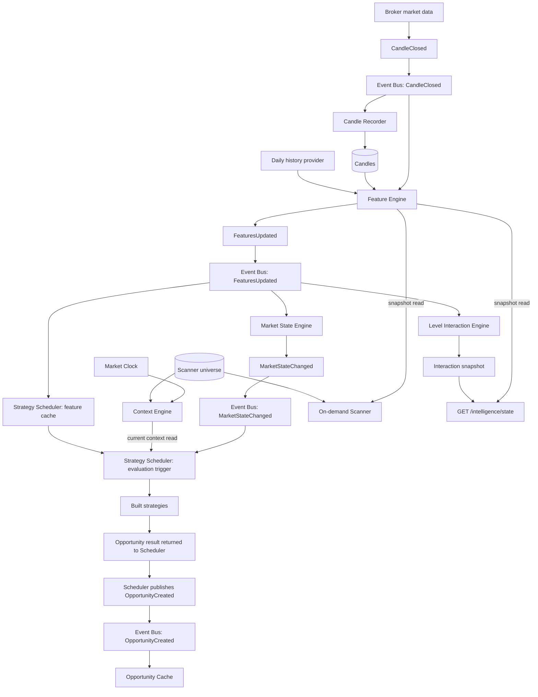
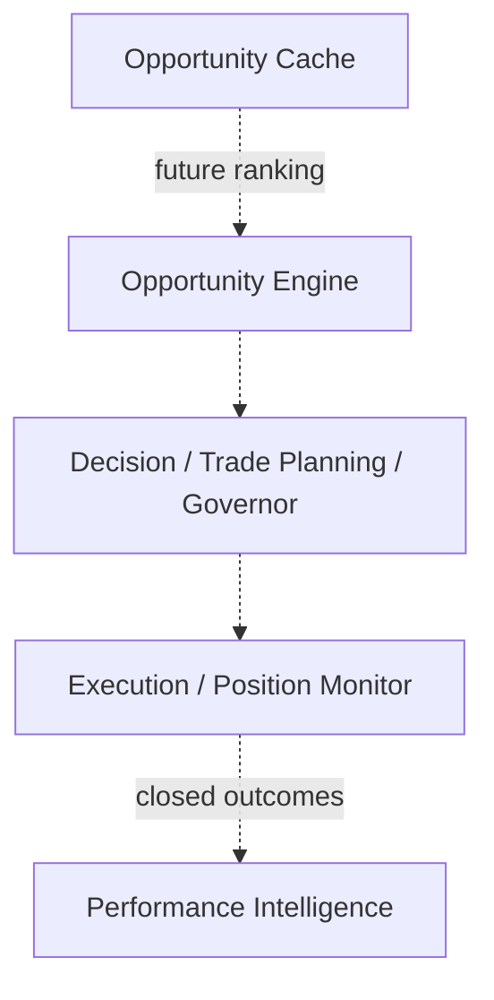
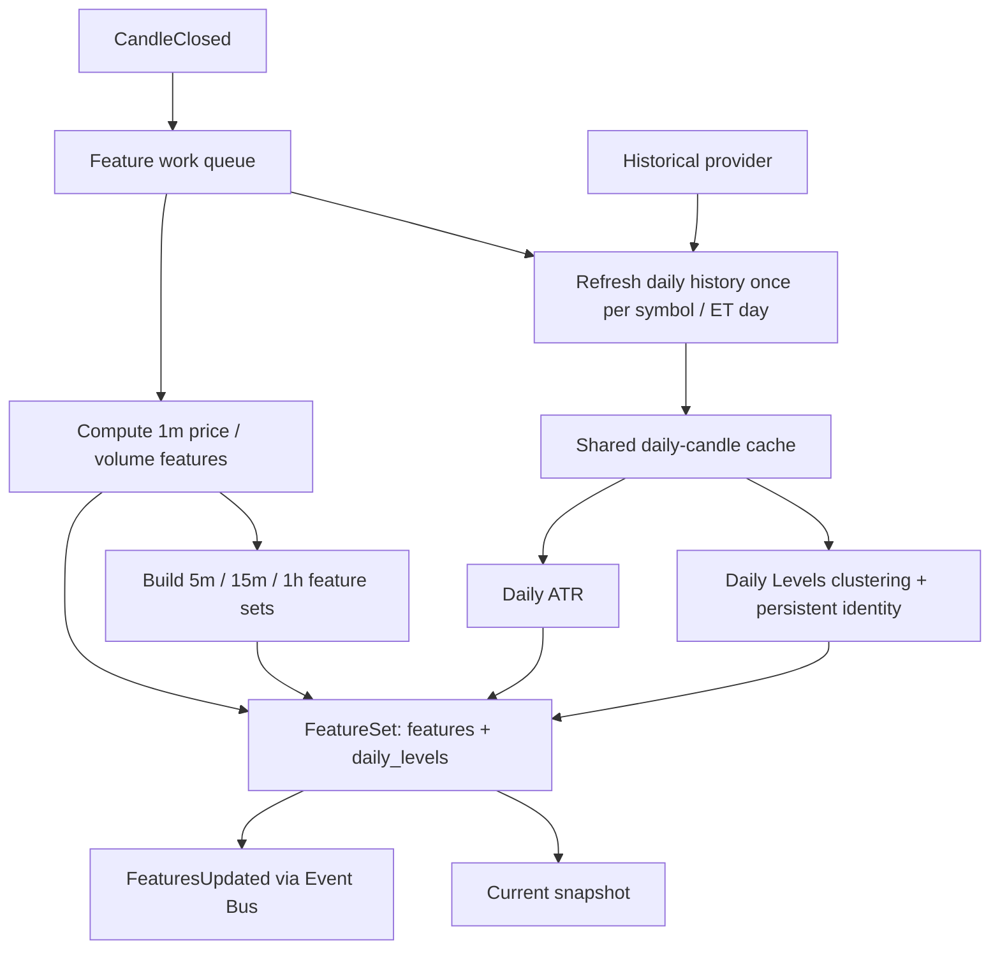
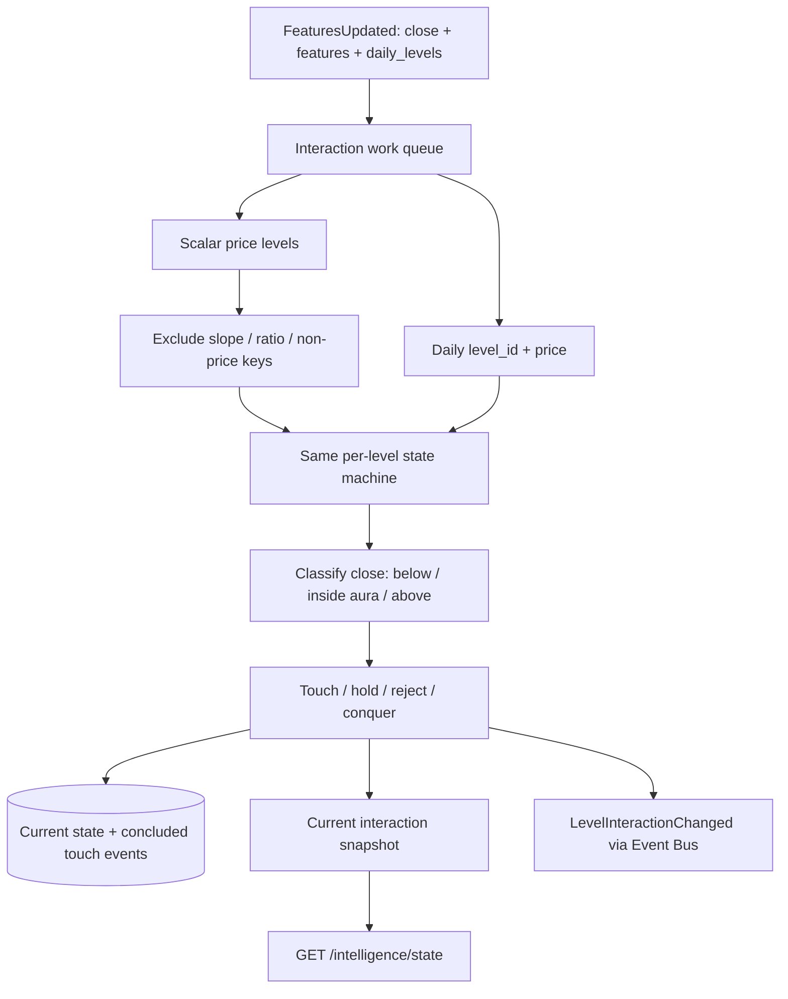
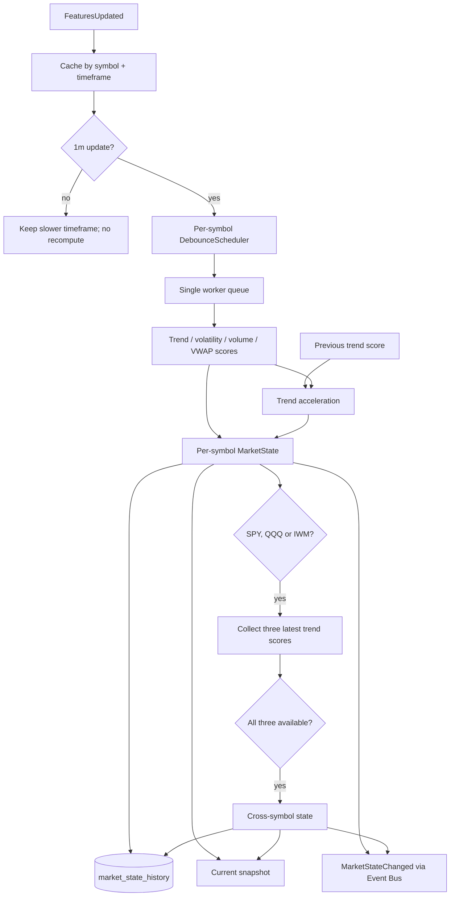
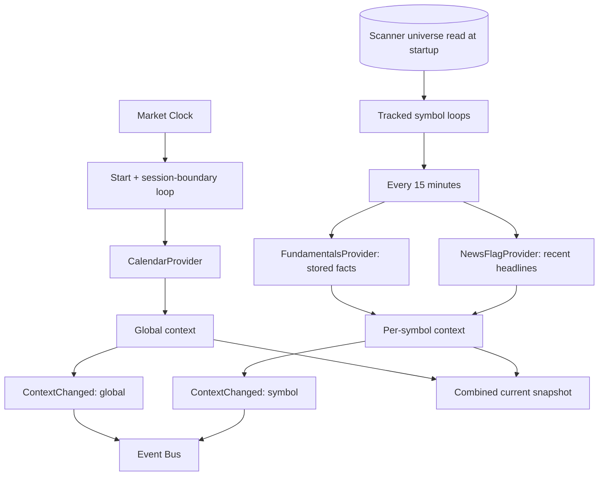
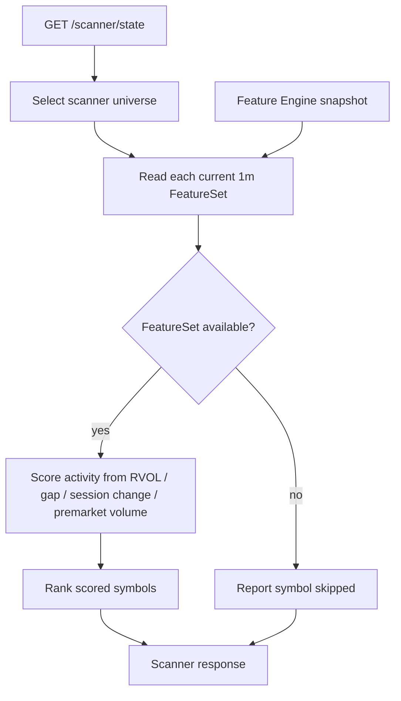
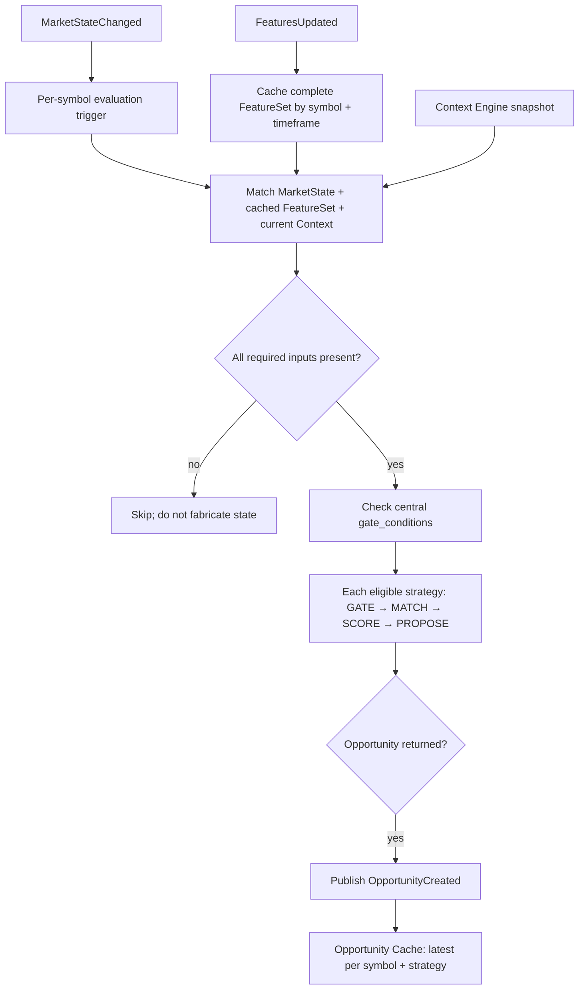
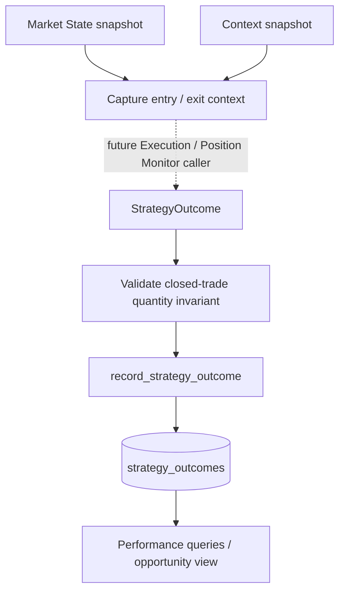

# Trading intelligence: flowcharts

Solid arrows are live communication or reads. Dashed arrows are future wiring. Events pass through the Event Bus; snapshot arrows are direct reads.

## 1. Live component flow

Market State and Context are separate inputs to strategy evaluation. The Scanner ranks current features on request; it does not feed the Scheduler.

## 2. Feature Engine

## 3. Level Interaction Engine

## 4. Market State Engine

## 5. Context Engine

## 6. On-demand Scanner

## 7. Strategy Scheduler and strategies

The trigger is `MarketStateChanged`, after Market State has updated its cache. The Scheduler publishes opportunities; the cache does not rank them.

## 8. Performance evidence: built paths and missing live caller

The outcome schema, capture function, write path, and read queries exist; live fill and exit callers do not.

Detailed contracts: [trading intelligence architecture](../architecture/trading-intelligence-architecture.md), [system design](../architecture/system-design.md), [Daily Levels design](../architecture/daily-levels-design.md), and [strategy design](../architecture/strategy-engine-design.md) (plus its siblings [backtest runner design](../architecture/backtest-runner-design.md), [open decisions](../architecture/strategy-engine-open-decisions.md), and [build history](../architecture/strategy-engine-build-history.md)).
