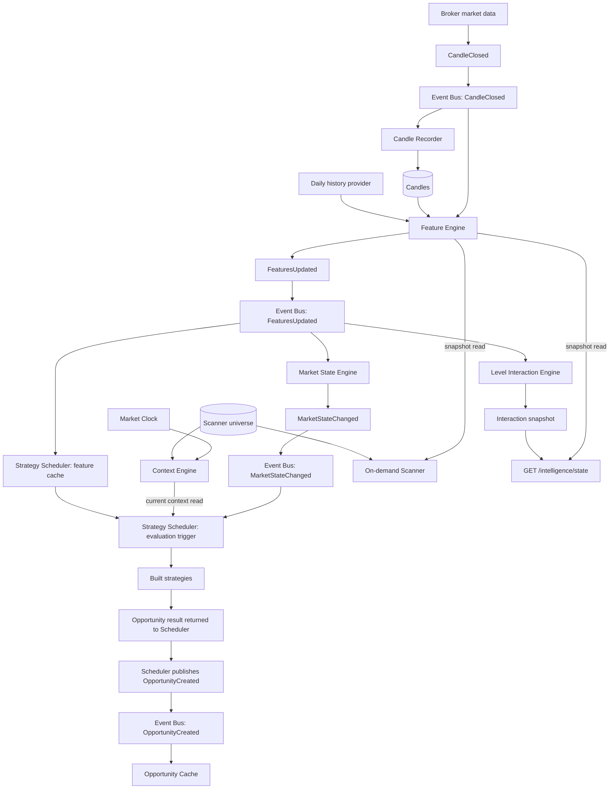
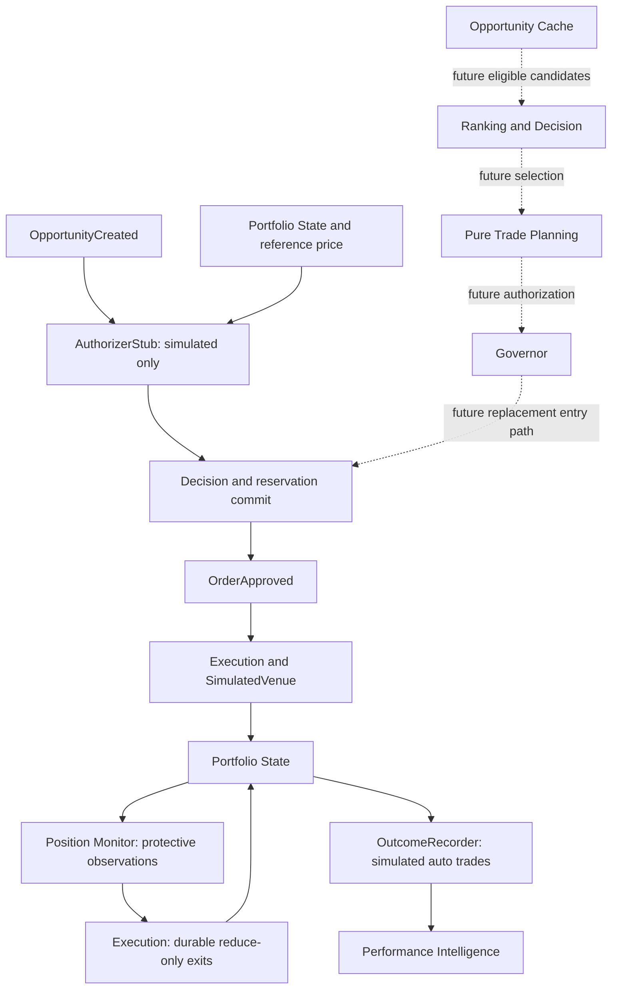
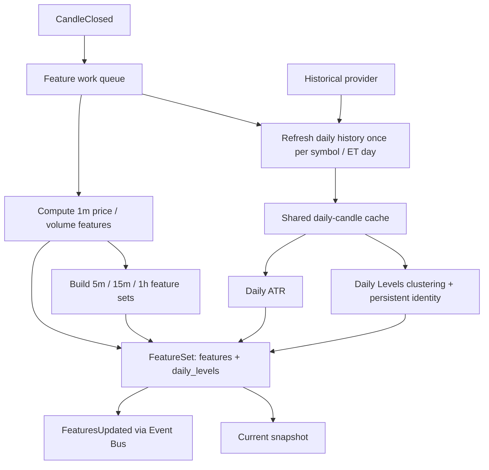
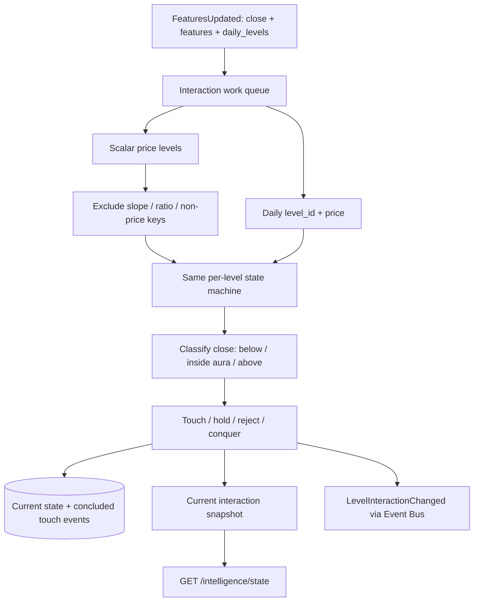
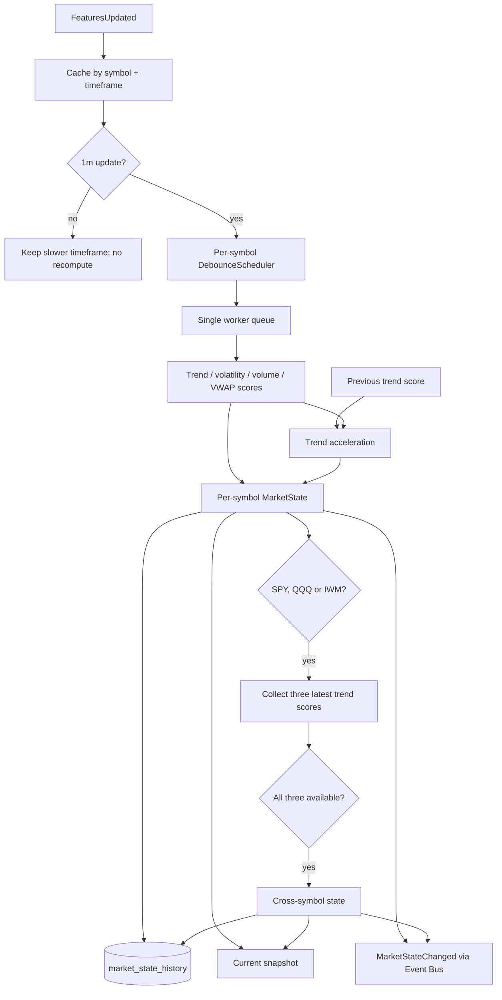
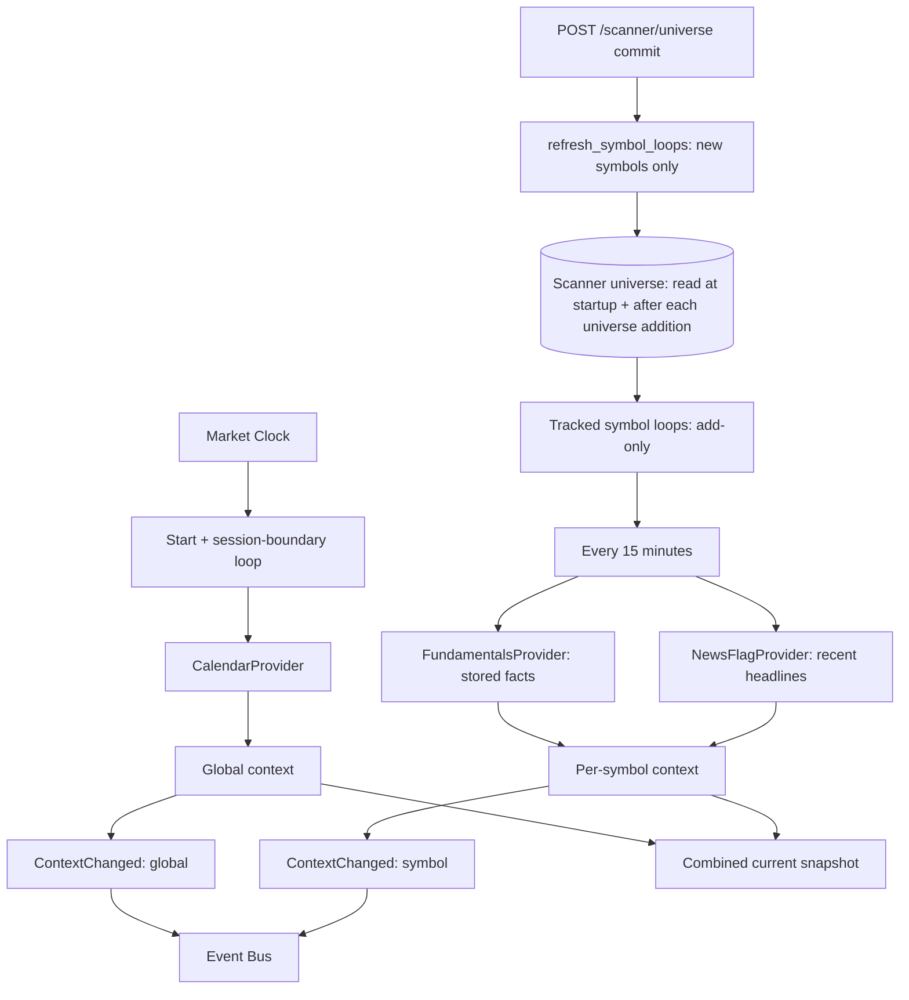
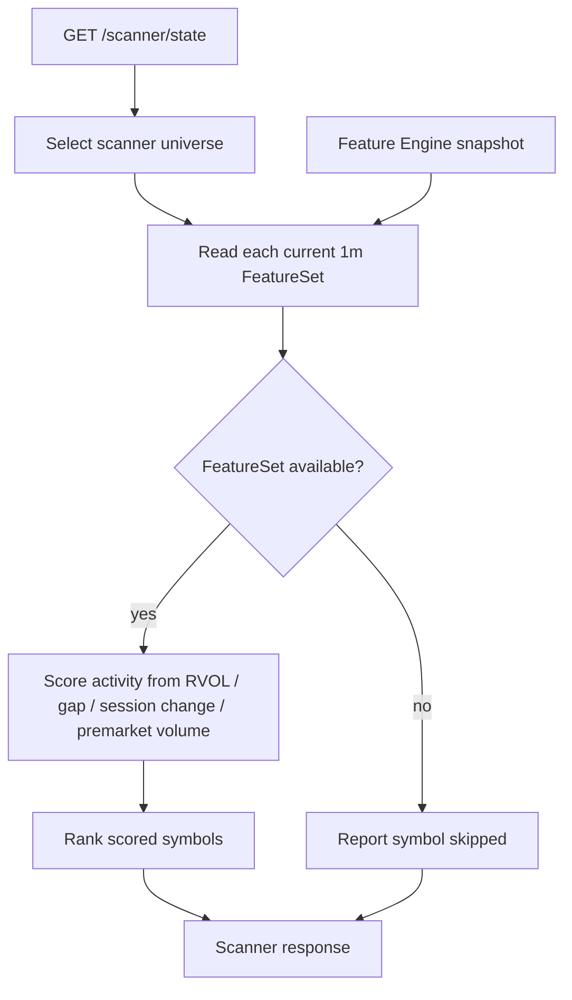
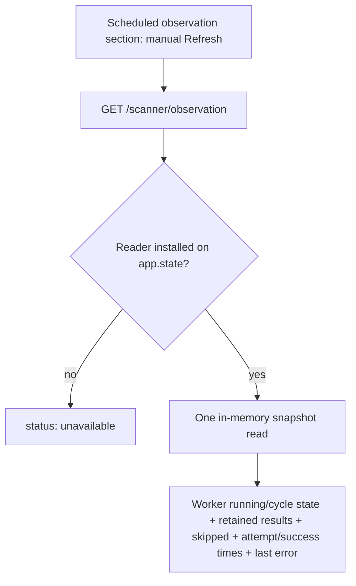
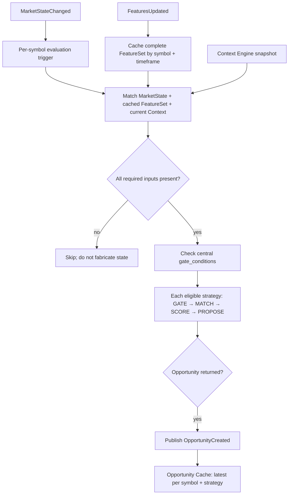
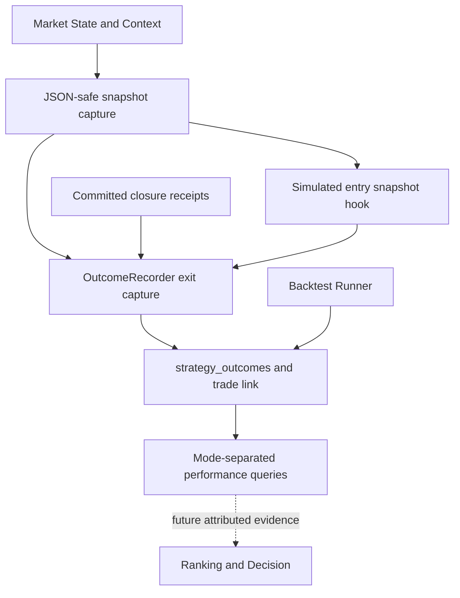

# Trading intelligence: flowcharts

Solid arrows are live communication or reads. Dashed arrows are future wiring. Events pass through the Event Bus; snapshot arrows are direct reads. Updated against `f7f5c51` for `opportunity-decision-planning-governor-contract-refinement`; canonical future module/internal flows are in trading-intelligence-architecture.md §19 and execution-engine-design.md §6.14.6.

## 1. Live component flow

```mermaid
flowchart TD
    DATA[Broker market data] --> CLOSED[CandleClosed]
    CLOSED --> BUSC[Event Bus: CandleClosed]
    BUSC --> REC[Candle Recorder]
    REC --> CANDLES[(Candles)]
    BUSC --> FE[Feature Engine]
    CANDLES --> FE
    HISTORY[Daily history provider] --> FE
    FE --> UPDATED[FeaturesUpdated]
    UPDATED --> BUSF[Event Bus: FeaturesUpdated]
    BUSF --> LI[Level Interaction Engine]
    BUSF --> MS[Market State Engine]
    BUSF --> FC[Strategy Scheduler: feature cache]
    LI --> INTERACTION[Interaction snapshot]
    MS --> MARKET[MarketStateChanged]
    MARKET --> BUSM[Event Bus: MarketStateChanged]
    BUSM --> TRIGGER[Strategy Scheduler: evaluation trigger]
    CLOCK[Market Clock] --> CE[Context Engine]
    UNIVERSE[(Scanner universe)] --> CE
    CE -- current context read --> TRIGGER
    FC --> TRIGGER
    TRIGGER --> STRATEGIES[Built strategies]
    STRATEGIES --> RESULT[Opportunity result returned to Scheduler]
    RESULT --> CREATED[Scheduler publishes OpportunityCreated]
    CREATED --> BUSO[Event Bus: OpportunityCreated]
    BUSO --> CACHE[Opportunity Cache]
    FE -- snapshot read --> SCAN[On-demand Scanner]
    UNIVERSE --> SCAN
    FE -- snapshot read --> STATE[GET /intelligence/state]
    INTERACTION --> STATE
```

Market State and Context are separate inputs to strategy evaluation. The Scanner ranks current features on request; it does not feed the Scheduler.

```mermaid
flowchart TD
    BUS["OpportunityCreated"] --> STUB["AuthorizerStub: simulated only"]
    PORT["Portfolio State and reference price"] --> STUB
    STUB --> COMMIT["Decision and reservation commit"]
    COMMIT --> ORDER["OrderApproved"]
    ORDER --> EX["Execution and SimulatedVenue"]
    EX --> PS["Portfolio State"]
    PS --> MON["Position Monitor: protective observations"]
    MON --> EXIT["Execution: durable reduce-only exits"]
    EXIT --> PS
    PS --> OUT["OutcomeRecorder: simulated auto trades"]
    OUT --> PERF["Performance Intelligence"]
    CACHE["Opportunity Cache"] -. future eligible candidates .-> RANK["Ranking and Decision"]
    RANK -. future selection .-> PLAN["Pure Trade Planning"]
    PLAN -. future authorization .-> GOV["Governor"]
    GOV -. future replacement entry path .-> COMMIT
```

The future path replaces the stub subscription at explicit simulated cutover; both may not authorize concurrently. The present cache is descriptive and cannot become eligible state without the lifecycle contract in §19.2. D4 ranking remains open.

## 2. Feature Engine

```mermaid
flowchart TD
    CLOSED[CandleClosed] --> QUEUE[Feature work queue]
    QUEUE --> REFRESH[Refresh daily history once per symbol / ET day]
    HISTORY[Historical provider] --> REFRESH
    REFRESH --> DAILYCACHE[Shared daily-candle cache]
    DAILYCACHE --> DAILY[Daily Levels clustering + persistent identity]
    DAILYCACHE --> ATR[Daily ATR]
    QUEUE --> COMPUTE[Compute 1m price / volume features]
    COMPUTE --> AGG[Build 5m / 15m / 1h feature sets]
    DAILY & ATR & COMPUTE & AGG --> SET[FeatureSet: features + daily_levels]
    SET --> LATEST[Current snapshot]
    SET --> EVENT[FeaturesUpdated via Event Bus]
```

## 3. Level Interaction Engine

```mermaid
flowchart TD
    UPDATED[FeaturesUpdated: close + features + daily_levels] --> QUEUE[Interaction work queue]
    QUEUE --> SCALAR[Scalar price levels]
    QUEUE --> DAILY[Daily level_id + price]
    SCALAR --> FILTER[Exclude slope / ratio / non-price keys]
    FILTER --> PROCESS[Same per-level state machine]
    DAILY --> PROCESS
    PROCESS --> AURA[Classify close: below / inside aura / above]
    AURA --> TRANSITION[Touch / hold / reject / conquer]
    TRANSITION --> DB[(Current state + concluded touch events)]
    TRANSITION --> SNAP[Current interaction snapshot]
    TRANSITION --> EVENT[LevelInteractionChanged via Event Bus]
    SNAP --> ROUTE[GET /intelligence/state]
```

## 4. Market State Engine

```mermaid
flowchart TD
    UPDATED[FeaturesUpdated] --> STORE[Cache by symbol + timeframe]
    STORE --> CHECK{1m update?}
    CHECK -- no --> ONLY[Keep slower timeframe; no recompute]
    CHECK -- yes --> DEBOUNCE[Per-symbol DebounceScheduler]
    DEBOUNCE --> QUEUE[Single worker queue]
    QUEUE --> SCORE[Trend / volatility / volume / VWAP scores]
    PRIOR[Previous trend score] --> ACCEL[Trend acceleration]
    SCORE --> ACCEL
    SCORE & ACCEL --> STATE[Per-symbol MarketState]
    STATE --> DB[(market_state_history)]
    STATE --> SNAP[Current snapshot]
    STATE --> EVENT[MarketStateChanged via Event Bus]
    STATE --> INDEX{SPY, QQQ or IWM?}
    INDEX -- yes --> CROSS[Collect three latest trend scores]
    CROSS --> READY{All three available?}
    READY -- yes --> COMPOSITE[Cross-symbol state]
    COMPOSITE --> DB
    COMPOSITE --> SNAP
    COMPOSITE --> EVENT
```

## 5. Context Engine

```mermaid
flowchart TD
    CLOCK[Market Clock] --> BOUNDARY[Start + session-boundary loop]
    BOUNDARY --> CALENDAR[CalendarProvider]
    CALENDAR --> GLOBAL[Global context]
    UNIVERSE[(Scanner universe: read at startup + after each universe addition)] --> SYMBOLS[Tracked symbol loops: add-only]
    ADD[POST /scanner/universe commit] --> REFRESH[refresh_symbol_loops: new symbols only]
    REFRESH --> UNIVERSE
    SYMBOLS --> TIMER[Every 15 minutes]
    TIMER --> FUND[FundamentalsProvider: stored facts]
    TIMER --> NEWS[NewsFlagProvider: recent headlines]
    FUND & NEWS --> LOCAL[Per-symbol context]
    GLOBAL --> GEVENT[ContextChanged: global]
    LOCAL --> SEVENT[ContextChanged: symbol]
    GLOBAL & LOCAL --> SNAP[Combined current snapshot]
    GEVENT & SEVENT --> BUS[Event Bus]
```

## 6. On-demand Scanner

```mermaid
flowchart TD
    REQUEST[GET /scanner/state] --> UNIVERSE[Select scanner universe]
    UNIVERSE --> LOOKUP[Read each current 1m FeatureSet]
    FEATURES[Feature Engine snapshot] --> LOOKUP
    LOOKUP --> AVAILABLE{FeatureSet available?}
    AVAILABLE -- no --> SKIP[Report symbol skipped]
    AVAILABLE -- yes --> SCORE[Score activity from RVOL / gap / session change / premarket volume]
    SCORE --> RANK[Rank scored symbols]
    RANK & SKIP --> RESPONSE[Scanner response]
```

Separate read-only status view (`scanner-observation-status`); it never scans, so it is not part of the flow above:

```mermaid
flowchart TD
    PANEL[Scheduled observation section: manual Refresh] --> ROUTE[GET /scanner/observation]
    ROUTE --> SLOT{Reader installed on app.state?}
    SLOT -- no --> UNAVAILABLE[status: unavailable]
    SLOT -- yes --> READ[One in-memory snapshot read]
    READ --> VIEW[Worker running/cycle state + retained results + skipped + attempt/success times + last error]
```

## 7. Strategy Scheduler and strategies

```mermaid
flowchart TD
    UPDATED[FeaturesUpdated] --> FEATURECACHE[Cache complete FeatureSet by symbol + timeframe]
    MARKET[MarketStateChanged] --> TRIGGER[Per-symbol evaluation trigger]
    TRIGGER --> JOIN[Match MarketState + cached FeatureSet + current Context]
    FEATURECACHE --> JOIN
    CONTEXT[Context Engine snapshot] --> JOIN
    JOIN --> READY{All required inputs present?}
    READY -- no --> SKIP[Skip; do not fabricate state]
    READY -- yes --> GATE[Check central gate_conditions]
    GATE --> EVAL[Each eligible strategy: GATE → MATCH → SCORE → PROPOSE]
    EVAL --> RESULT{Opportunity returned?}
    RESULT -- yes --> PUBLISH[Publish OpportunityCreated]
    PUBLISH --> CACHE[Opportunity Cache: latest per symbol + strategy]
```

The trigger is `MarketStateChanged`, after Market State has updated its cache. The Scheduler publishes opportunities; the cache does not rank them.

## 8. Performance evidence: built simulated and backtest writers

```mermaid
flowchart TD
    M["Market State and Context"] --> CAP["JSON-safe snapshot capture"]
    CAP --> ENTRY["Simulated entry snapshot hook"]
    CAP --> EXIT["OutcomeRecorder exit capture"]
    FILL["Committed closure receipts"] --> EXIT
    ENTRY --> EXIT
    EXIT --> DB["strategy_outcomes and trade link"]
    BT["Backtest Runner"] --> DB
    DB --> QUERY["Mode-separated performance queries"]
    QUERY -. future attributed evidence .-> R["Ranking and Decision"]
```

Simulated auto-trade and backtest outcome writing exist. Paper/live/manual writers remain outside those slices. Acceptance fixtures prove lifecycle mechanics, not predictive edge. Rejected and non-selected candidates are audit records, never realized outcomes.

Detailed contracts: [trading intelligence architecture](../architecture/trading-intelligence-architecture.md), [system design](../architecture/system-design.md), [Daily Levels design](../architecture/daily-levels-design.md), and [strategy design](../architecture/strategy-engine-design.md) (plus its siblings [backtest runner design](../architecture/backtest-runner-design.md), [open decisions](../architecture/strategy-engine-open-decisions.md), and [build history](../architecture/strategy-engine-build-history.md)).
